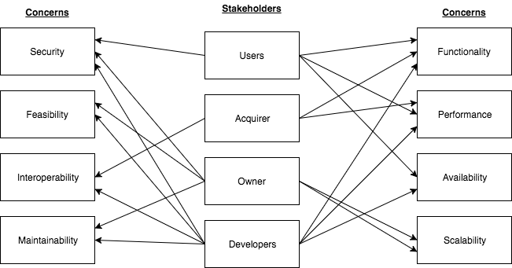
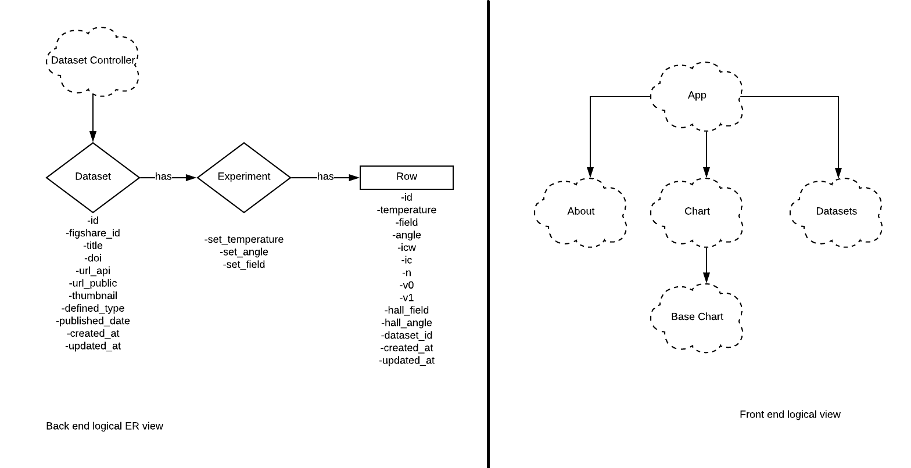
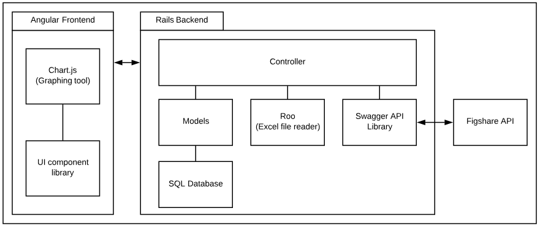
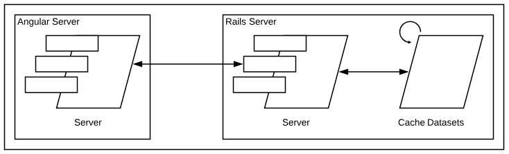
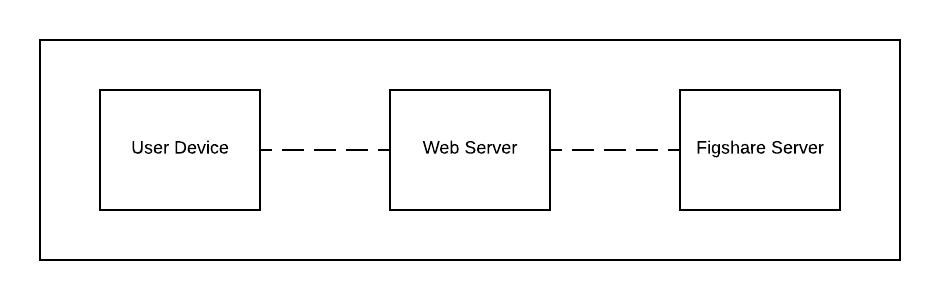
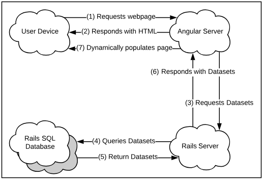

---
title: "ENGR 301 Project 14 Architectural Design and Prototype"
author: "Ben Percy, Brady Hanna, Callum Li, David Hack, Ryan Cherry, Ryan Field"
---

# 1. Introduction

This document will detail the Architectural Design and Prototype of the Figshare Data Visualizer.

## Client

The client for this project is Dr. Stuart Wimbush, a senior scientist at the Robinson Research Institute.

### Stuart's contact details:

|    Phone       |       Email              |
|    ------      |       -----              |
| +64 4 463 0093 | stuart.wimbush@vuw.ac.nz |

## 1.1 Purpose

Create a system that provides interactive browsing and exploration of Robinson Research Institute's high-temperature superconducting (HTS) wire database hosted on Figshare.

## 1.2 Scope

The **Figshare Data Visualizer** will provide a free and accessible way for interested public users to browse and interact with scientific superconductor data. The system will be a web application which users can access through a web browser on either a desktop or mobile device.

The objective is to capture the interest of new and casual users of the database by providing a more visually appealing and easy to use interface. This should promote usage of the database from these types of users. The system should visually guide the user to provide an intuitive and simple first experience to encourage continued use. There will be a big emphasis on interactive browsing so that the user will be engaged with the data.

The software will provide dynamically generated graphs, meaning the client won't need to manually process and create new graphs as the database expands and evolves over time.

## 1.3 Changes to requirements

None.

---

# 2. References

See end of document.

---

# 3. Architecture

## 3.1 Stakeholders

### Stakeholders:

Users

:    Public members and scientists

Acquirer

:    The client, Dr. Stuart Wimbush

Owner

:    Robinson Research Institute

Developers

:    ENGR301 Project 14 members

### Concerns:

Functionality

:    The project architecture should support being able to display a list of all datasets, interactive graphs of requested data and filtering of displayed data.

Performance

:    The project architecture should provide a sufficient experience on modern devices and provide similar, or better, loading times similar to the current native Figshare user interface. The site should work on all modern broswers and mobile devices, with no decrease in performance 

Availability

:    The project architecture should be designed with as close to 100% availability in mind. The site is always up unless it is being redeployed, as the caching needs to be performed. 

Scalability

:    The project architecture should be able to support future changes and upgrades as demand changes and should be capable of handling either small or large volumes of traffic.

Maintainability

:    The project architecture should be designed in a way that allows an external party to the initial development team to be able to update and support the application over its lifetime.

Security

:    We have a private key for the deployment servers, so only specfic people can deploy versions of the project

Feasibility

:    The goal of the project architecture should be attainable in the given timeframe and development environment constraints including time and budget.

Interoperability

:    The project architecture should be primarily designed to run on modern desktop and mobile devices, with support for older devices if possible.

{height=300px}

For further information regarding stakeholders and concerns for the Figshare Data Visualizer refer to the requirements document [@req-doc].

## 3.2 Architectural Viewpoints

Logical Viewpoint

:    This viewpoint addresses the functionality concern.

Development Viewpoint

:    This viewpoint addresses interoperability, maintainability, scalability, security, and functionality.  

Process Viewpoint

:    This viewpoint addresses performance, availability and feasibility concern.

Physical Viewpoint

:    This viewpoint addresses the interoperability, availability, scalability and maintainability concerns.

Scenarios Viewpoint

:    This viewpoint addresses how all the other four viewpoints seamlessly work together [@kruchten1995].

---

# 4. Architectural Views

The following sections are laid out in accordance to Kruchten's 4+1 model[@kruchten1995], sections 5.5, 5.6 from IEEE 42010 [@ieee42010] and Annex F from both IEEE 12207 [@ieee12207] and 15288 [@ieee15288].

## 4.1 Logical

The architecture is made up of 2 systems. The frontend system managing what the user sees, and the backend system handles the
database and querying the Figshare API.

The responsibility of the App class is to provide a common interface across all the pages with content injected into it from other pages. To do this, it fills in blank space with either a Datasets page, or a Chart page. Every time it requires new data, the App will send a query to the DatasetController. We chose to structure it this way so that there would be less duplicated code, and make the App easier to update
in the future. Different web pages can be added by making more subpages for the App. The Datasets page provides a list of all the datasets available to be viewed from the Robison Research Institute's Figshare. The Chart page represents the specific dataset, and Graph represents the specific datasets graph. Base Chart is a wrapper of Chart-JS.

The responsibility of the DatasetController is to handle the SQL database and calls to the Figshare API.
When the DatasetController receives a request from the front end the DatabaseController will serve
either a list of the datasets or a specific dataset. DatasetController represents the main interface between the front and backend, as well as the main interface between the web server and the Figshare API.

The Dataset, Experiment and Rows are entries in the local database. A Dataset represents a specific Datasets metadata from the Robison Research Institute's Figshare. An Expirement contains a list of Rows as well as the 'set' fields. Rows are a row of data from a superconductor test that belongs to a specific Dataset. The model above is an ER model due to how data orientated the backend is.

## 4.2 Development

Angular was chosen to be the frontend framework because of how powerful it is. It easily allows for asynchronous requests allowing the front end to appear more responsive. Angular is also highly extensible and NPM makes it easy to add libraries to the
frontend. One of the big disadvantages to Angular is the steep learning curve [@altexsoft_2017]. This problem is alleviated by a member of the team
having prior experience with Angular. Angular is the view of our backend controller and models.

Within Angular, there are two major components of development. These are the graphing tool used to display the data and the UI components.
We are using the graphing tool, Chart.js which simplifies displaying the data [@chartjs] but will still require configuring.
The UI components are a major part of Angular and will require significant customization. This can be solved partially by using Angular
Material [@material] which is a comprehensive library of UI components.

Ruby on Rails is the backend framework, chosen for being well established and data orientated. Being data orientated Rails allows
for abstraction between the database and the code with Active Records and Models. Rails is also highly extensible through gems
(libraries) which are easy to add and use. Rails provides both the controller and the models for the Angular front end.

There are two main areas of development within Rails models and controllers. The models are required to abstract the data in
the database into objects such as a dataset and the rows in it. This will allow for storing the data sourced from the Figshare servers locally to reduce response time to queries. Controllers are required for handling incoming requests from the frontend and will respond with JSON formatted data.

Roo is an Excel file reader [@roo], required because the data files in the Robison Research Institute's database are stored in XLSX format. The Figshare API provides an endpoint to gather the data from the Robinson Research Institute's superconductor database. The Figshare API is very simple and provides a library generated by Swagger [@swagger] to make API calls.

## 4.3 Process

For this project, there is a frontend server and a backend server. Angular is being used for the frontend web application, with Ruby on Rails as the supporting backend framework. 
Having a specific frontend and backend gives the application separation of concerns. This allows both servers to operate individually, as separate processes.  

Caching is an integral part of this project. Instead of requesting the data on every single request, the data is downloaded once and stored in a local database. This allows the project to satisfy the non-functional requirement of performance.
Without caching the data would need to be downloaded on every single request, resulting in longer loading times. This is not only because of the request and downloading of the data but also because of overhead costs such as setting up connections. With the data stored in a local database, loading times will be significantly shorter.
Caching datasets will be a periodic process that happens on a set timer. Any datasets that have been added will be cached and changed datasets will be cached again.

## 4.4 Physical

The Web Server hosts our application and serves it to the Users Device through the internet. Specifically, the web server
hosts the frontend, backend, and database services. The physical server will be outside of the team's control, but needs
to accessible by the team in some way so that the application can be pushed to it.

The Figshare server is a vital component but is external and outside of the team's control. The Figshare server hosts the
data and provides an API for accessing that data through the internet. That API is utilised by the Web Server to retrieve
the graphing data.

The User Device can be any device with internet browsing capabilities. The User Device will request the application from
the Web Server through the internet. There are potential hardware requirements for the User Device that will need to be
ascertained and deliberated.

There are also tests that need to be done with regards to the bandwidth, latency and speed requirements for the internet
connection between these components. The most critical connection of which is that between the User Device and the Web
Server, as it is required to serve the application and will be the most frequently used.

\pagebreak

## 4.5 Scenarios

### Scenario 1: Viewable datasets

This use case covers the generic architectural flow of our system and serves a backbone for all other use cases to be supported by as shown in the figure above.

1. The user requests a webpage using their own device from the Angular server.
2. The Angular server responds to this request with the HTML page. This is generated from a combination of the App and Datasets classes.
3. The Angular server then asynchronously requests the datasets from the Rails server. This moves the work from the frontend to the backend.
4. The Rails server queries the Rails database for the datasets requested by the user. This is done using the DatasetController in Rails server.
5. The datasets are then returned by the database to the server. This is done using the Rails Dataset and Row models.
6. The Rail server responds to the Angular server to pass on the data it retrieved from the database.
7. The Angular server dynamically updates the content on the page.  

This scenario is not end-to-end from the user device to the Figshare API. The other half of the end-to-end process is performed by a background caching operation. The caching process ensures that the local Rails database mirrors the Figshare database.

---

# 5. Development schedule

### Server hosting 

The client is hosting this project on his own AWS account.

## 5.1 Schedule

Refer to requirements document for a full up to date schedule.

## 5.4 Risks

Refer to requirements document for a up to date list of risks.

# 6. Appendices

## 6.1 Assumptions and dependencies

1. Figshare
   * To provide the datasets

## 6.2 Acronyms and abbreviations

API

:	Application Programming Interface

ER model

:	Entity–relationship model

NPM

:	Node Package Manager for JavaScript programming language

MVP

:	Minimum viable product

# 7. Contributions

**Ben Percy**

1. Section 4.3.
2. Reading/drafting section 4.5 and discussing changes.
3. Frontend Angular code.

**Brady Hanna**

1. Sections 1 & 3.
2. Setting up make files for pdf etc.
3. Large portion of the frontend Angular code.
4. Setting up references.
5. Final formatting of document and review.

**Callum Li**

1. Sections 4.4 & 5.
2. Reading section 4.1 and discussing changes.
3. Setting up remote server.
4. Backend architecture and design planning.
5. Training others in Ruby.

**David Hack**

1. Section 4.2.
2. Reading the whole file and discussing changes.
3. Assisting others in direction of their sections.
4. Backend code and design.
5. Team management & client contact.
6. Made all architecture view models/blueprints

**Ryan Cherry**

1. Section 4.1.
2. Proof reading the whole file.
3. Spell checking.
4. Helping with some risks in section 5.
5. Learning Ruby.

**Ryan Field**

1. Section 4.5.
2. Backend code.
3. Learning Ruby.

---

# References
