# Deployment platform setup

## Prerequisites

* Amazon Web Services Account - [sign up here](https://portal.aws.amazon.com/billing/signup#/start "sign up link") 

## Setting up an EC2 Instance

### 1. Login - [here](https://console.aws.amazon.com/console/home)
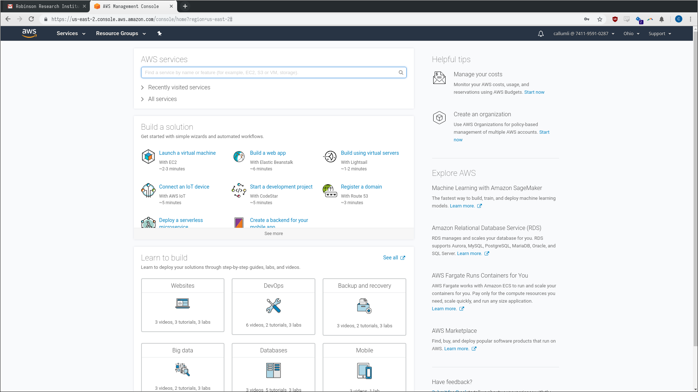

### 2. Under "All Services" and then under "Compute" select "EC2"
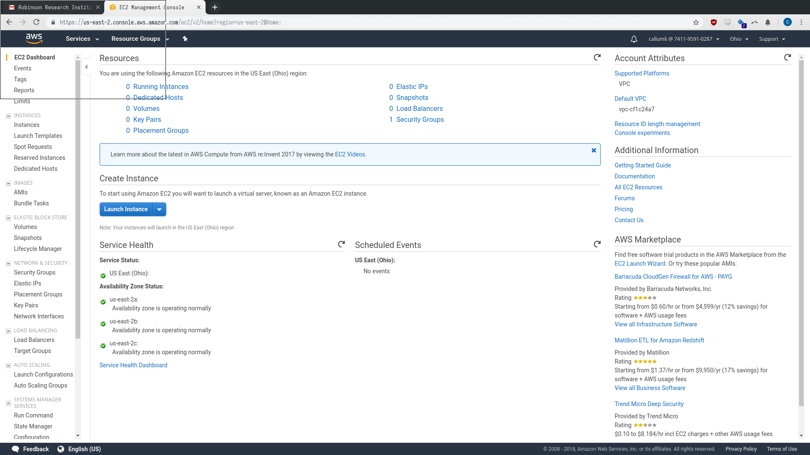

### 3. Press the "Launch Instance" button
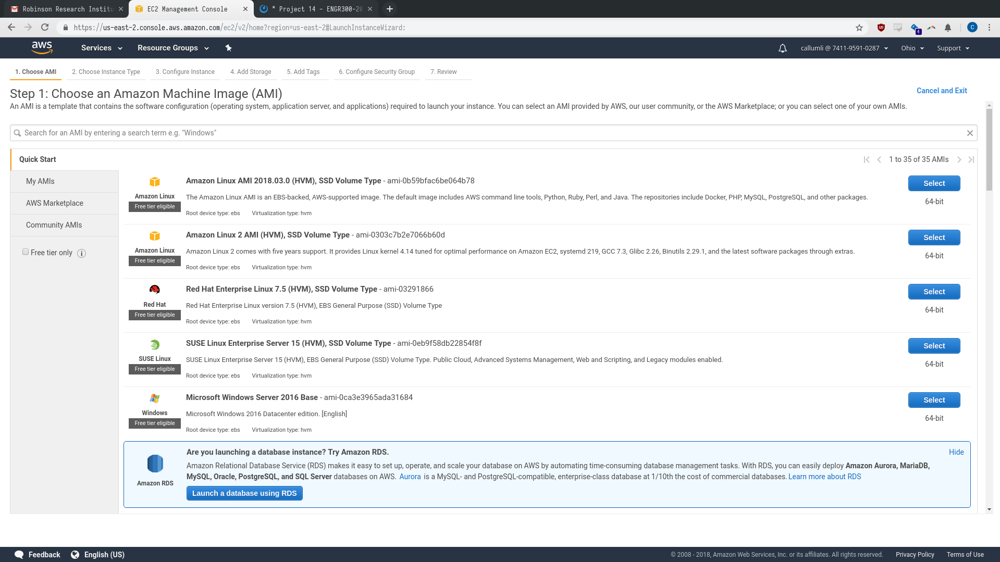

### 4. Select "Amazon Linux 2 AMI (HVM), SSD Volume Type"
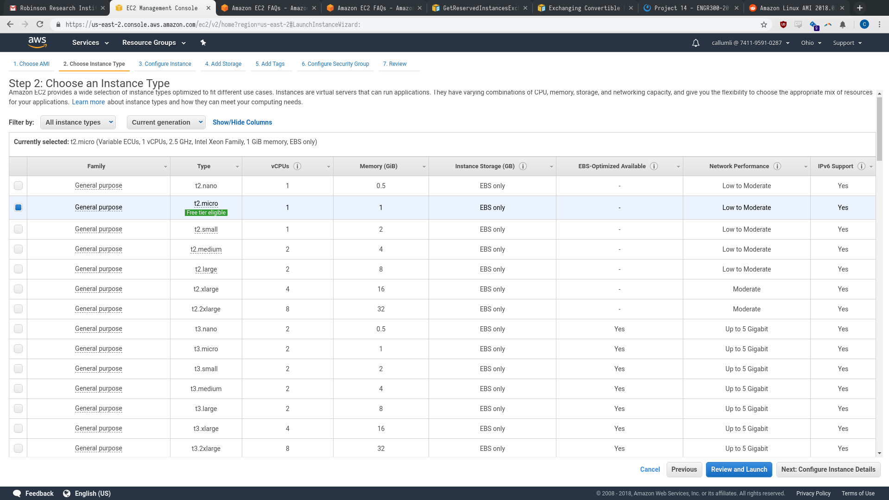

### 5. Select instance type.
The confirmed working minimum hardware specifications are
1vCPU and 1GiB memory. Pricing information can be found
[here](https://aws.amazon.com/ec2/pricing/)

The instance used for this example is a **t2.small** which
costs approximately $5 USd a month.

### 6. Press "Review and Launch"
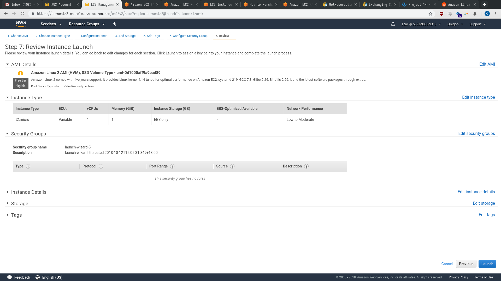

### 7. Press "Edit security groups"
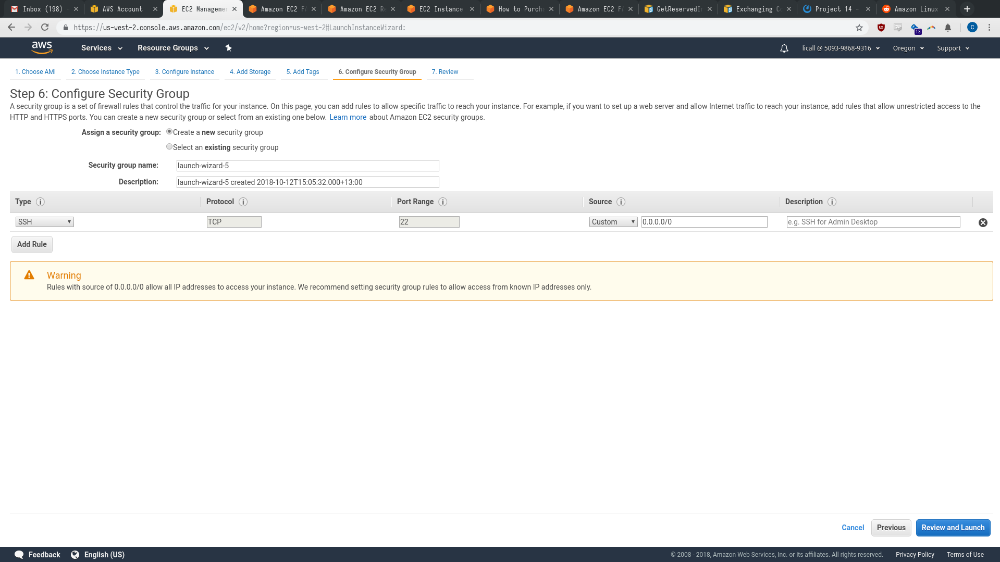

### 8. Allow HTTP and HTTPS requests to the server
1. Press "Add Rule"
2. Change its type to "HTTP"
3. Press "Add Rule"
4. Change its type to "HTTPS"

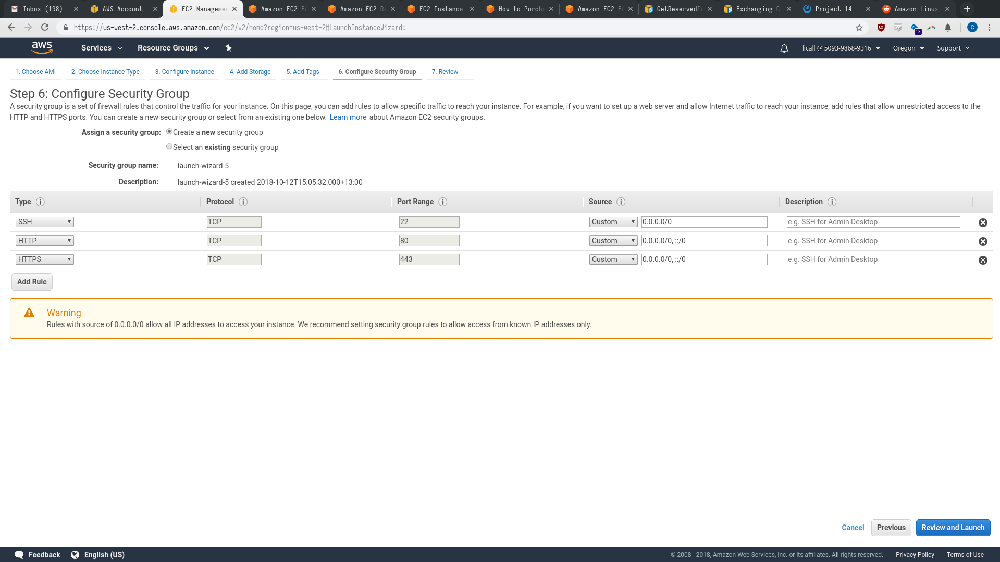

### 9. Press "Review and Launch"
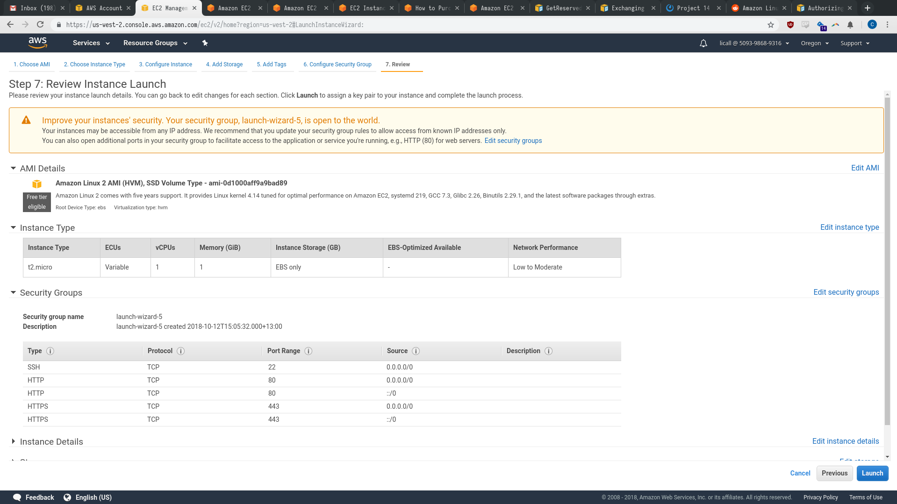

### 10. Press "Edit Storage"
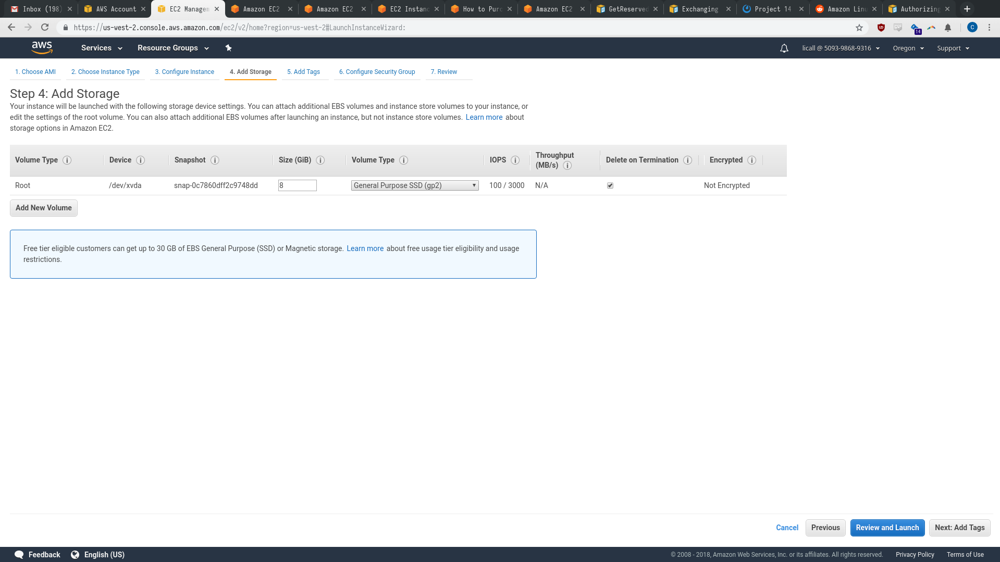

### 11. Edit "Size" to "20" (GiB)

### 12. Press "Review and Launch"
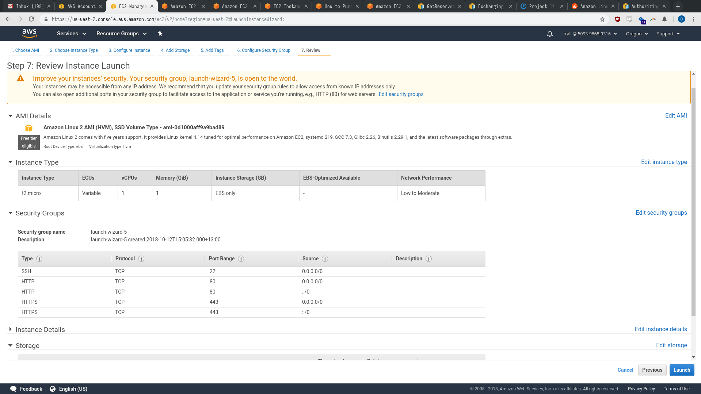

### 13. Press "Launch"
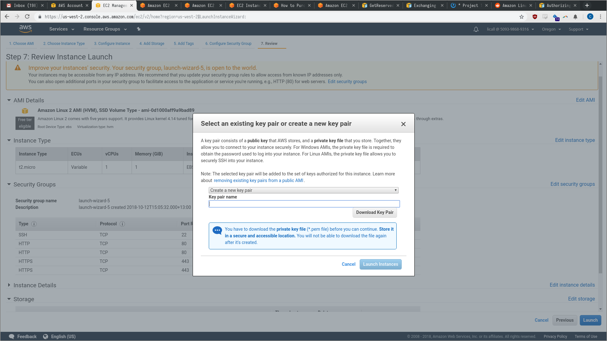

### 14. Choose "Create a key pair", give it a name (e.g. rridb.pem), and press "Download Key Pair"

### 15. Press "Launch Instances"
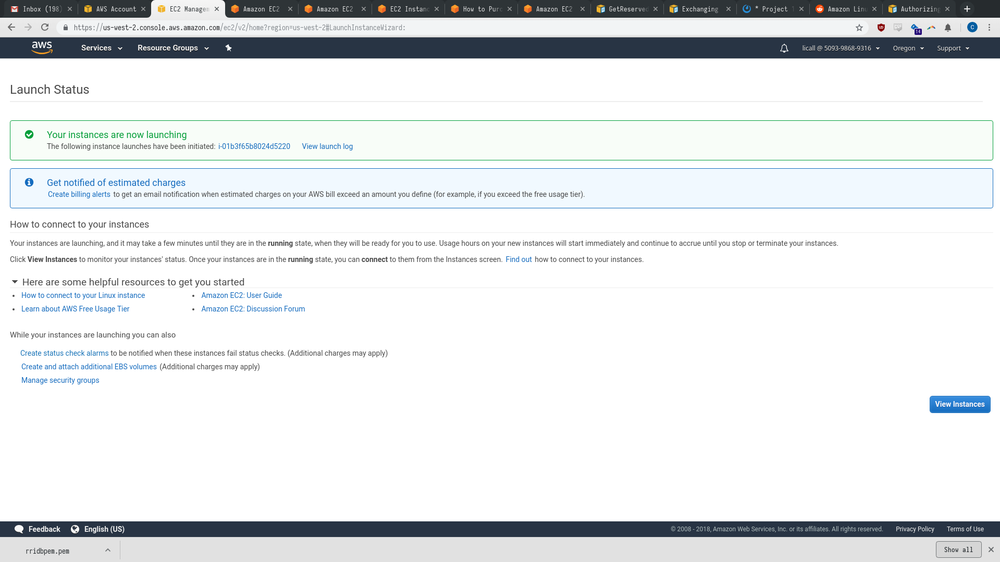

### 16. Store the key pair safe. It is the key to the server.

### 17. If you need to transfer the key to someone, use secure means.
Secure means include but are not limited to:
1. Physically transferring it via USB
2. Encrypting it with a passphrase (e.g. with AES encryption)
and sending the encrypted result via email and the passphrase
via phone
3. Use SCP to transfer the file

### Setting up an Elastic IP

### 18. Go back to the EC2 dashboard (as in step 2)
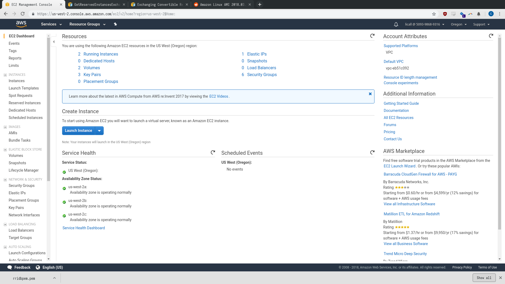

### 19. Click "Elastic IPs" in the left side menu.
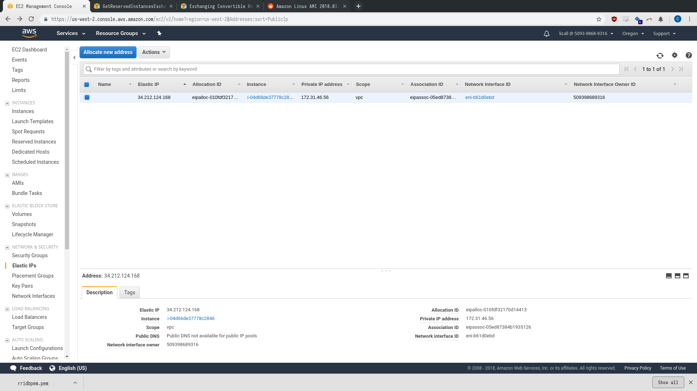

### 20. Press the blue "Allocate new address" button
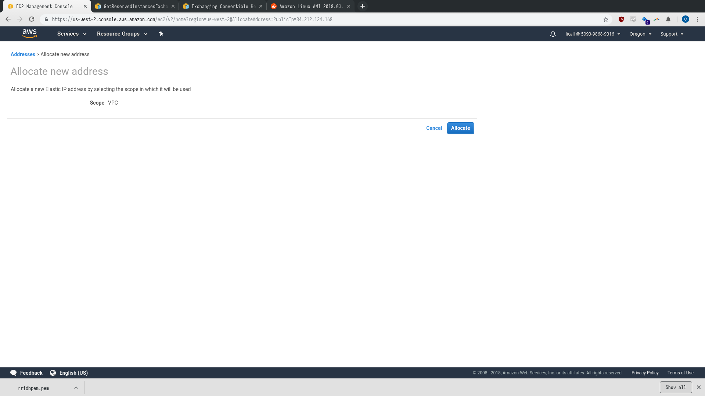

### 21. Press "Allocate"
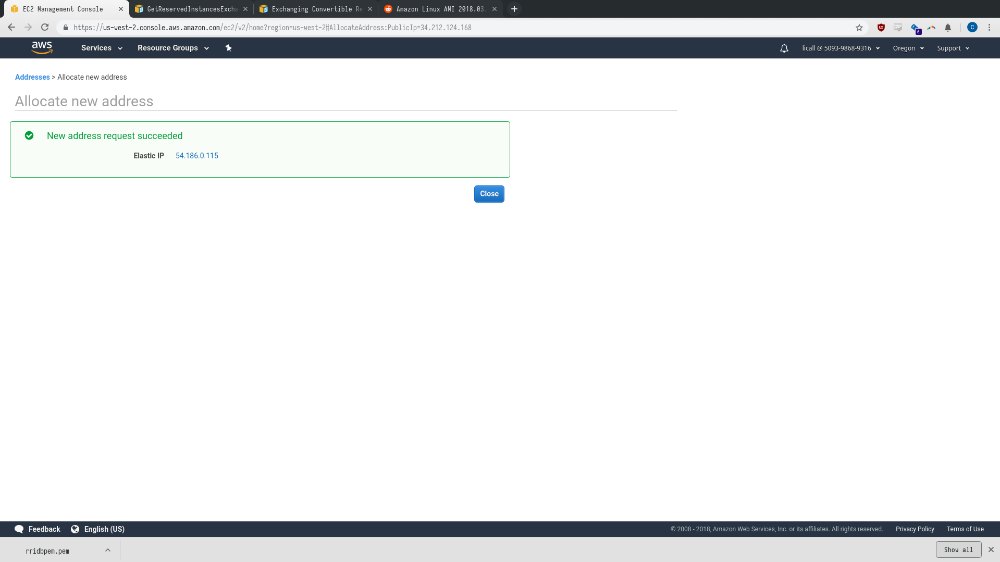

### 22. Press close
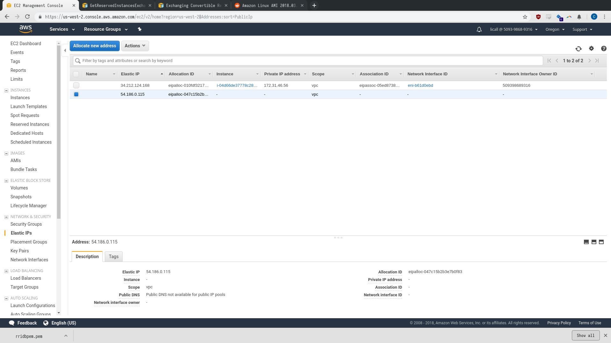

### 23. Select the newly allocated address and under “Actions” (next to the blue button) press “Associate address”.
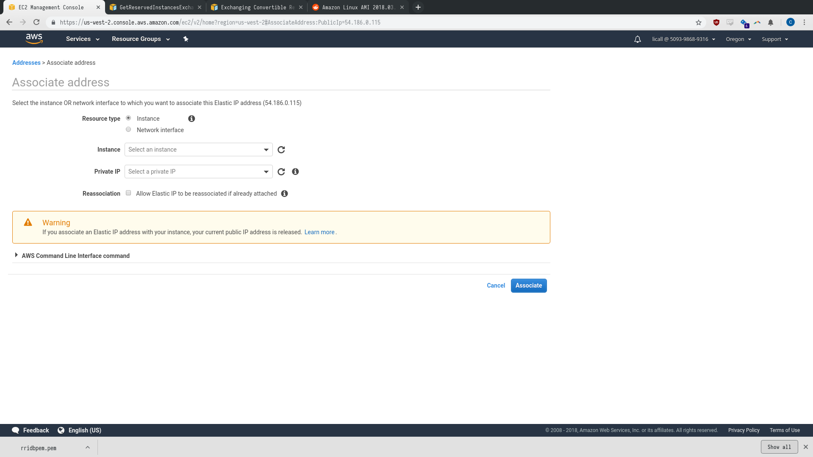

### 24. Under “Instance” select the instance we previously created and press “Associate”

