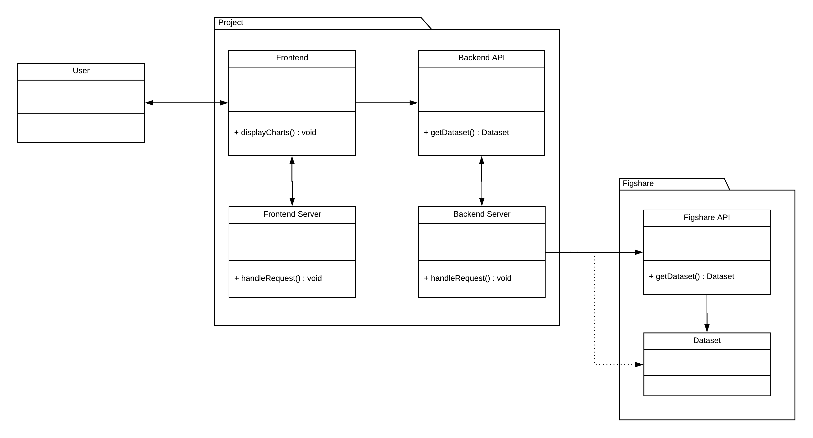

# ENGR 301 Project 14 Project Proposal and Requirements Document
#### Ben Percy, Brady Hanna, Callum Li, David Hack, Ryan Cherry, Ryan Field

---

## 1. Introduction
### Client

The client for this project is Dr. Stuart Wimbush, a senior scientist at the Robinson Research Institute. 

##### Stuart's contact details:
|    Phone       |       Email              |
|    ------      |       -----              |
| +64 4 463 0093 | stuart.wimbush@vuw.ac.nz |

### 1.1 Purpose

Create a system that provides a public facing interactive browsing and exploration of Robinson Research Institute's high-temperature superconducting (HTS) wire database hosted on Figshare.

### 1.2 Scope

The **High Temperature Superconducting Wire Database** will provide a free and accessible way for interested public users to browse and interact with scientific superconductor data. The system will be a web application which users can access through a web browser on either a desktop or mobile device. 

The objective is to capture the interest of new and casual users of the database by providing a more visually appealing and easy to use interface. This should promote usage of the database from these types of users. The system should visually guide the user to provide an intuitive and simple first experience to encourage continued use. There will be a big emphasis on interactive browsing so that the user will be engaged with the data.

The software will provide dynamically generated graphs, meaning the client won't need to manually process and create new graphs as the database expands and evolves over time. 

### 1.3 Product overview
#### 1.3.1 Product perspective

The High Temperature Superconducting Wire Database will be a web-based application that can be accessed via a modern web browser, such as Chrome or Firefox. It will deliver a consistent and relevant user interface for both mobile and desktop users. Internal users who maintain the database will not have to change their processes as the system only consumes this database and will not modify it in any way. 

{#id .class height=350}

There are three main components in the High Temperature Superconducting Wire Database. These are:

* Web application (System back end)
* Web server (System front end)
* Figshare database

These three main components are joined together through their interfaces (API's) to act as a formatting pipeline between the raw data in the Figshare database and the web application presented to the user. 

The web application is responsible for presenting the user with nicely formatted graphs and providing a clean and intuitive experience. The web server will provide the web application with the relevant data to create a facade between the web application and the Figshare database. Finally, the Figshare database will store the data and serve this to the web server. 

The software will not need to worry too much about processor or memory limitations as it will be run on modern devices with relatively powerful specifications. Also since most of the computation is involved with the web server the user should not be impacted in use apart from loading times. The system will need to interact with a remote database, therefore an internet connection is required. All of the data needed will be stored remotely by the Figshare database, so the only local storage required will be a small amount for caching purposes. 

#### 1.3.2 Product functions

The main function of the High Temperature Superconducting Wire Database is to browse superconductor data. The user will initially be presented with a list of all available superconductor types from which they can select one to browse. Once the user has selected an option they will be presented with a graph that has plotted the selected data. The user will be able to interact with this graph to enhance their experience, such as clicking/tapping on points to view the numerical value. Users will also be able to modify graph axis to explore different relations in the data.

The web server should be able to query the Figshare database to retrieve a list of all the available superconductor data the user can select. It should then be able to interpret the provided data from the database and output a formatted JSON file for use by the web application to display the graph. This should be done dynamically as future data added to the database should be able to be converted to JSON too without modifying the web server. 

The MVP should achieve parity with the current solution (Figshare Database) in addition to being able to dynamically handle data additions to Figshare. The MVP should provide a much improved user experience so that it is much clearer to the user how to find and view graphs and data. 

#### 1.3.3 User characteristics   

One class of primary users of the High Temperature Superconducting Wire Database are scientists and engineers who either research or use superconductors in their work. These people are highly qualified in their respective fields and are very likely already using the Figshare data directly. These people will be power users and will be using the system to look up and compare multiple different types of superconductors. They will not be too worried about visual aesthetics, but more about the depth of information they can get. This type of user will use the data regardless of how it is presented as they need it but would appreciate a system that makes it easier to access while still retaining the greater functionality they require. 

Another group of primary users the system is trying to appeal to are casual and interested users. They would likely be accessing the data in their own time and not for work related purposes. This type of user is someone who wants an easy and visually appealing user experience and would look elsewhere if they find the application too difficult to use. Their use of the system will be to look-up some data on superconductors they are interested in. This type of user is what the system is designed to be for so it is important to address their requirements. 

The secondary group of people impacted by the High Temperature Superconducting Wire Database (but do not necessarily directly use it) are maintainers of the Figshare database, in particular our client. This user will already have a deep understanding of the inner workings of Figshare and maintaining this is their primary concern. 

#### 1.3.4 Limitations

The success of the application depends on the consistency of the data contained in the Figshare database. This is because the web server depends on the data format to have the same structure as previous data entries. Therefore, while the system will be designed to support future additions dynamically, if new data formats are introduced the system may not be able to correctly function. 

Since the application will be in part tied to the Robinson Research Institute name it is important that the system also meets their requirements. These could include safety or security of data. This is to ensure that because the application would include their branding it does not negatively impact the company. 

The availability of the application is also tied to the Figshare database's availability in addition to the uptime of the application. As this application does not have critical uptime requirements small amounts of the application being unavailable is acceptable. In these instances, the system should handle failures gracefully.

The data we are working with is openly available to the public and we likely won't be having user authentication. Therefore the whole application will also be freely accessible. Security risks will be low as no data will be exposed that is not already available. 

Since the application will be developed using modern web frameworks, users on older and outdated devices may struggle to run or be unable to access features. In this case, the application will try support as far back as is feasible, and if a device is truly unusable the application will notify the user why their device is unsupported.

---

## 2. References

1. IEEE, "International Standard ISO/IEC/IEEE 29148," *http://mmf.nsu.ru*, document, Dec. 12, 2012. [Online]. Available: http://mmf.nsu.ru/sites/default/files/iso-iec-ieee-29148-2011.pdf. [Accessed Mar. 20, 2018].

---

## 3. Specific requirements  

### 3.1 External interfaces

#### Input

**Name:** Robinson Research Institute Figshare Database

**Description:** The Figshare API will allow us to pull data from the Robinson Research Institute's experiments on superconducting wires. The data will be in a raw format and require further processing for the front end. The Figshare API requires OAuth and all requests to be in https making it secure but more complicated to query data from.

**Source:** Figshare API 

**Valid range, accuracy, and/or tolerance:** The data found in the Robinson Research Institute Figshare Database has been uploaded by the client and is assumed to be accurate and within tolerance at this point. Therefore, there is no need to validate that the data is within a range or certain tolerances from this source. However, the format of the data is expected to be in the same format and structure as all previously uploaded data. If the structure differs it is unlikely that the system back end will be able to handle that difference.

**Relationships to other interfaces:** The data obtained from this interface will be manipulated by the system back end into a format suitable for the system front end (output). 

**Data formats:** All data responses from the Figshare API will be in the JSON format.

**Command format:** All requests to the Figshare API will be done in https.

#### Output

**Name:** System Front End

**Description:** The front end of the system will display the information from the input.

**Source:** The source of the output will be provided by the system which will do the bulk of processing the data into a usable format for the front end.

**Valid range, accuracy, and/or tolerance:** This will be determined by the user of the system as they will be able to select what data from the database is displayed and how it is displayed. After that, it is up to the system backend to provide the correctly formatted data to the front end. As a result, the front end will do very little verification of the data supplied.

**Relationships to other interfaces:** The output will not be altering the input to it from the system back end in any way. Meaning that the responsibility of the system back end is to ensure the data is correctly formated and structured for the front end. The system front end (output) responsibility is to take that data and display it visually to the users.

**Data formats:** The data received by the front end will be JSON formatted to be easily handled by javascript.

**Command format:** The system back end will be written in Ruby on Rails meaning that requests from the front end can be in either http or https.

### 3.2 Functions
The "System" refers to the system being developed, and is a secondary actor in all use cases technically but is not listed as such for simplicity.

#### MVP & Top priority Use Cases
##### **1. View available datasets**
**Primary Actor:** End-user

**Secondary Actor(s):** Figshare API

**Level:** User goal

**Goal:** Users would like to view all available datasets from the Robinson Research Institute's public database of high temperature superconducting wire performance to be able to select which one to view.

**Body:**

1. The user navigates to the "Datasets" page via the website or directly.
2. The system front end will display a loading screen if sourcing the data will take longer then a few seconds.  
3. The system back end will send the appropriate request with authorization to the Figshare API for a list of all the different datasets stored by the Robinson Research Institute that are **visable**.
4. The Figshare API responds with the list of all the datasets.
5. The system front end will display the list of all available datasets to the user.

**Extensions:**

* 2-5 Error due to timeout, API error or Browser incompatibility:
    1. The system front end displays an informative error message that is easy to understand and potentially fix from the user's end.
    
##### **2. View a specific dataset**
**Primary Actor:** End-user

**Secondary Actor(s):** Figshare API

**Level:** User goal

**Goal:** Users would like to view all the data relating to a specific wire published by the Robinson Research Institute to gain an understanding of its performance.

**Body:**

1. The user navigates to a "Dataset" page via "Datasets" page or directly.
2. The system front end will display a loading screen if sourcing the data will take longer then a few seconds.  
3. The system back end will send the appropriate request with authorization to the Figshare API for the dataset.
4. The Figshare API responds with all the data for the specific dataset.
5. The system back end will process the data into the required format for the front end.
6. The system front end will display the data in the form of graph(s) for temperature, critical current & field angle. The system should also take into account that the user may want to compare data from two different browser windows. Graph characteristics like scale should be aligned if possible.
7. The system front end will display a link to download source data for the dataset.

**Extensions:**

* 2-6 Error due to timeout, API error or Browser incompatibility:
    1. The system front end displays an informative error message that is easy to understand and potentially fix from the user's end. For querying a specific dataset via link this could be due to a change in the datasets visibility.
    
##### **3. Mirrors Figshare**
**Primary Actor:** Internal-user (Such as our client Stuart Wimbush)

**Secondary Actor(s):** Figshare API

**Level:** User goal

**Goal:** Internal maintainers of the Figshare database would like for the system to mirror the state of Figshare so that they only need to maintain the Figshare database.

**Body:**

1. When an internal user modifies the state of the Figshare database by adding. editing or removing.
2. When the system back end queries Figshare it should only retrieve visible datasets and not hidden ones. The system should also stop displaying deleted datasets.
3. This implies that if the system takes advantage of local database caching that it should ensure that the cache is up to date with the state of Figshare.
    
#### Other Use Cases
##### **4. Filter available datasets**
**Primary Actor:** End-user

**Level:** User goal

**Goal:** Users would like to filter datasets by characteristics of the data eg (Manufacturer, Model) in order to find information on a specific product(s).

**Body:**

1. Assuming the user is on a fully loaded "Datasets" page.
2. The user filters the list of datasets by a specific characteristic.
3. The system will remove datasets that do not match the filter from view allowing the user to easily browse the remaining datasets. This may require a re-query to the back end.

**Extensions:**

* 3 There are no datasets that match the filter:
    1. The system front end displays an informative message telling the user nothing matched the filter.
    
##### **5. Sort listed datasets**
**Primary Actor:** End-user

**Level:** User goal

**Goal:** Users would like to sort datasets by characteristics of the data eg (Date uploaded, Views) to find datasets they are interested in.

**Body:**

1. Assuming the user is on a fully loaded "Datasets" page.
2. The user sorts the list of datasets by a specific characteristic.
3. The system front end will reorder the datasets by that characteristic and indicate which characteristic it is sorting it by and in which order ASC/DESC.

##### **6. Compare two datasets (Stretch Goal)**
**Primary Actor:** End-user

**Secondary Actor(s):** Figshare API

**Level:** User goal

**Goal:** Users would like to compare datasets graphs to easily see the differences between two superconducting wires.

**Body:**

1. Assuming the user is on a fully loaded "Dataset" page.
2. The system front end provides the user with the option to easily select another dataset unobtrusively, that does not include the current dataset. The system should also take into account that some datasets may not be appropriate to compare to others through differences in data.
3. The user selects a dataset to compare with the currently viewed one.
4. The system front end will display a loading status to the user if sourcing the data will take longer then a few seconds.  
5. The system back end will send the appropriate request with authorization to the Figshare API for the dataset.
6. The Figshare API responds with all the data for the other dataset.
7. The system back end will process the data into the required format for the front end.
8. The system front end will display data from both datasets together on the graph in a helpful manner.

**Extensions:**

* 2 There are no other datasets:
    1. The system does not allow comparison to be clicked on and displays why.
* 4-8 Error due to timeout, API error or Browser incompatibility:
    1. The system front end displays an informative error message that is easy to understand and potentially fix from the user's end.
    2. system front end returns to displaying the original dataset by itself.
    
##### **7. Customize graphs**
**Primary Actor:** End-user

**Level:** User goal

**Goal:** Users would like to be able to select what data is on each axis of the graph to view different relations in the dataset.

**Body:**

1. Assuming the user is on a fully loaded "Dataset" page.
2. The system front end displays a default graph with default axis.
3. The system provides the user with the option to easily select what data to apply to each axis, in an elegant manner. The system should not allow the user to select the same data to be on both axis, depending on what is selected on the other axis.
4. The user selects a different set of data for one of the axis.
5. The system back end provides the data for the new axis.
6. The system front end regenerates the graph with the new data and axis.

**Extensions:**

* 3 There is no other related data for the dataset:
    1. The system does not allow the axis customization to be clicked on and displays why.
* 5-6 Error due to timeout, API error or Browser incompatibility:
    1. The system front end displays an informative error message that is easy to understand and potentially fix from the user's end.
    2. The system front end returns to displaying the graph that it was before and resets the axis labels
    
##### **8. Explore Data (Stretch Goal)**
**Primary Actor:** End-user

**Level:** User goal

**Goal:** Users would like to be able to deeply explore data from a dataset to gain a greater understanding of the data.

**Body:**

1. Assuming the user is on a fully loaded "Dataset" page.
2. The system front end should pop up data if the user hovers over a data point on the graph with more info.
3. The user clicks on the point.
4. The system front end should display the data that made up that point in a convenient way. This data is often another graph called an IV curve which forms a point on the main graph.

**Extensions:**

* 4 There is no source data for the point:
    1. The system does not allow the point to be clicked on.
* 4 Error due to timeout or Browser incompatibility:
    1. The system front end displays an informative error message that is easy to understand and potentially fix from the user's end.
    
##### **9. Export Graphs as Image**
**Primary Actor:** End-user

**Level:** User goal

**Goal:** Users would like to be able to export the graph that they create/view on the site to an image download to save the image for later.

**Body:**

1. Assuming the user is on a fully loaded "Dataset" page.
2. The user clicks on an export graph as image button.
3. The system back end generates an image of the graph.
4. The system front end supplies the image as a download.

**Extensions:**

* 3 Error due to timeout or Browser incompatibility:
    1. The system front end displays an informative error message that is easy to understand and potentially fix from the user's end.
    
##### **10. Export Graphs as CSV**
**Primary Actor:** End-user

**Level:** User goal

**Goal:** Users would like to be able to export the graph that they create/view on the site to an CSV based file to present the graph data in different formats.

**Body:**

1. Assuming the user is on a fully loaded "Dataset" page.
2. The user clicks on an export graph as file button.
3. The system back end generates a file of the graph data.
4. The system front end supplies the file as a download.

**Extensions:**

* 3 Error due to timeout or Browser incompatibility:
    1. The system front end displays an informative error message that is easy to understand and potentially fix from the user's end.
    
##### **11. Visit App From Mobile Device**
**Primary Actor:** End-user

**Level:** Summary

**Goal:** Users would like to be able to visit the site from a mobile device and still have a full-featured and appropriate experience for a small screen device.

**Body:**

1. The user navigates to the app on a mobile device.
2. The system front end detects the mobile device and styles/lays out pages appropriately for a good UX. Making use of design features such as hamburger menus and tabs to ensure that the data is still readable and has the appropriate amount of space.
    
##### **12. Advanced Back End Caching**
**Primary Actor:** System

**Secondary Actor(s):** Figshare API

**Level:** System goal

**Goal:** In order to speed up delivery time to the client, the system should cache data that it has requested from the Figshare API and keep it current.

**Body:**

1. When requesting data for the front end, the back end system first checks if that data is available in its local database.
2. If the data cache age is below a threshold it is served to the front end.

**Extensions:**

* 1 If the data is not available in the local database:
    1. The system back end will send the appropriate request with authorization to the Figshare API for the dataset.
    2. The Figshare API responds with all the data for the dataset.
    3. The system back end will process the data into the required format for the front end and store it in the system database.
    4. The data is served to the front end.
* 2 The data cache age is above the threshold:
    1. The system back end will send the appropriate request with authorization to the Figshare API for the last update time for the dataset.
    2. If the data has been updated since the last cache, the back end will query for and update the data in the local database.
    3. The data is served to the front end.
* 1-2 Error due to timeout or Browser incompatibility:
    1. The system front end displays an informative error message that is easy to understand and potentially fix from the user's end.

### 3.3 Usability Requirements

For our system, the target demographic will be people looking for data on superconductors. The system will be considered effective if it is able to become the preferred tool over the existing Figshare Database.

The system should do this by giving the users the ability to browse the data or search for specific data sets, display these data sets in an easy to read way and then provide the user with ways to alter the view of the datasets such as what data is displayed on each axis. When doing this the system should update visually in a responsive manner so that the user does not need to waste time waiting for a slow system. A great user experience will help make the system effective in achieving the above requirements.

The system will be deemed satisfactory if it can provide these services in a timely manner in a way that makes it easy for a more casual user to understand without watering down the output and losing information and functionality.

### 3.4 Performance requirements

At peak times with many users all wanting to access the entire range of data no single user should wait more than a couple seconds. This situation could occur if the client was at a conference and provided a link to the website. The website should handle this output in its final state, making use of caching if appropriate. If the website has more requests then it can serve users should be informed of the heavy traffic and to return later.

In more normal conditions where only a handful of people may be requesting a small portion of the data, no one should wait longer than a few seconds for the system to gather and graph the data. This would also depend on the user's internet speed and the speed of the device they are trying to access the website from.

For both cases, peak times and normal usage there are performance gains to be had by caching Figshare data in a local database for the system. This would provide huge benefit by allowing the system not to make calls to the Figshare API.

### 3.5 Logical database requirements

#### UML Diagram 

{#id .class height=500}

The **Figshare API** is an external component owned by Figshare. It acts as the
public interface to the **Datasets**.

The **Backend Server** is responsible for providing the **Backend API**. It
communicates with the **Figshare API** for access to the **Datasets** and
performs any data handling that is necessary before making it available
through the **Backend API**. This includes tasks such as formatting,
normalization, and caching.

The **Backend API** is the interface provided by the **Backend Server**
and provides the **Frontend** with access to the **Datasets** handled
by the **Backend Server**.

The **Frontend Server** is simply responsible for serving the **Frontend**.

The **Frontend** is the public/user facing component of the project. It provides
the user interface and user experience of the project, such as data visualization
and searching. It communicates with the **Backend API** to provide this functionality. 

### 3.6 Design constraints

The main constraint for this app is to provide a great user experience and UI while still providing robust functionality to analyze the data. The client's perspective on design emphasizes simplicity over additional complex functionality. Simply put this means if the addition of a new feature to the data visualizer complicates the user interface of the data visualizer too much, then it shouldn’t be added. A good balance needs to be struck, as the High Temperature Superconducting Wire Database needs to offer a large amount of utility whilst also being easy to use.

Another constraint is the use of the Figshare API. The project guidelines stated that the data sets must be accessed and stored on Figshare’s servers. This constrains the app from using local storage for the data which would provide many performance benefits. Another way that this constrains design is that *any* data can be uploaded to Figshare, meaning that the system back end will have to validate the format and structure of the data as it is querying it. Performance and speed must be taken into account, as while it is not a critical requirement, the data must be visualized in reasonable time to ensure a good user experience. Therefore the design may be constrained to the point where complicated caching is the only way to achieve the desired speed and reflection of Figshare.

The front end code must be written in a language and designed in a way that allows a good user experience for both mobile and desktop viewing. This means the High Temperature Superconducting Wire Database should have complete functionality on both devices. This constrains the choice of web frameworks to those that have support good support for both mobile and desktop browsers 

A large constraint on the design is that the client wishes it to be as available as possible. This means that the site needs to work for all possible browsers, eg Microsoft Edge, Firefox, Google Chrome. The client also stated his wish for the data visualizer to also be accessible to people running earlier versions of browsers. This is because many scientific workplaces still use very old computers. This can be a problem, as many current features are not supported by older browsers. 

There are also constraints on time and manpower. This project needs to be designed in a manner that can be completed by a team of 6 by the 19th of October. The work is also being done by students with other workloads and responsibilities, so not all available time can be focused on the project.

### 3.7 Physical and Environmental Requirements

The system will be installed on a VPS, either Victoria University hosted or privately. 
The system is portable and can be easily changed to be hosted on another server if bandwidth requirements change. The web application will be run on personal devices.

### 3.8 Supporting information

The client for this Project is Robinson Research Institute. The data visualized by the project is information regarding superconductors.

Figshare is a website that hosts and stores scientific data for academic research. What is currently stored in the repository are graphs handmade by the client and the original datasets so users can download and make their own.

The main problem to be solved with this project is the lack of any flexibility in the current system. If a user wants to visualize any data, they must do it entirely themselves by downloading the data. All the default graphs in the repository were created by the client, so any graph a user wants to make they will have to graph it themselves. This is a problem as it could deter many who are not willing to put in the time or lack understanding as to how. 

---

## 4. Verification

### Use Cases: 
#### Verification procedures
**View available datasets**

1. Navigate to website
    1. Displays the home screen
    2. Displays the available datasets

**View Specific Dataset**

1. Navigate to website
    1. Displays the home screen
    2. Displays the available datasets
2. Select a dataset to view
    1. System fetches dataset
    2. System processes it into viewable format
    3. System displays correct information to user

**Mirrors Figshare**

1. Data is altered on the figshare database in the form of a new dataset version
    1. Change is seen by the system
    2. Data changes are registered
    3. Any relevant caches are updated

**Filtering Available Datasets**

1. Navigate to website
    1. Displays the home screen
    2. Displays the available datasets
2. Apply filter to available datasets
    1. Displays datasets that are relevant to the filter
    2. Hides datasets that are irrelevant to the filter

**Sort Listed Datasets**

1. Navigate to website
    1. Displays the home screen
    2. Displays the available datasets
2. Apply sorting characteristic
    1. Reorders datasets to be ordered by sorting characteristic

**Compare Two Datasets**

1. *View Specific Dataset*
2. Select option to compare to dataset
    1. Displays all available datasets to compare to
3. Select dataset to compare to
    1. Alters graph to display both sets of data

**Customise Graphs**

1. *View Specific Dataset*
2. Select option to alter graph axis
    1. Displays different options for data to display
3. Select new data to display on the axis
    1. Alters graph to display new data on axis

**Explore Data**

1. *View Specific Dataset*
2. Select a data point on graph
    1. Displays more information about selected point

**Export Graphs As Image**

1. *View Specific Dataset*
2. Select option to export as image
    1. Creates image file of dataset
    2. Sends image file
3. Open image file
    1. Check it looks the same as web version

**Export Graphs as CSV**

1. *View Specific Dataset*
2. Select option to export as CSV
    1. Creates a file from dataset
    2. Sends file
3. Open file
    1. Check it looks the same as web version

**Visit App From Mobile Device**

1. Navigate to website from mobile device
    1. Detects using mobile device
    2. Displays website in mobile friendly mode rather than desktop 

**Advanced Back End Caching**

1.  Navigate to website
    1. Displays homepage
    2. Displays available datasets
2. Select dataset to view
    1. Checks cache (*hidden function*)
    2. Only fetches from figshare if cache is old
    3. Saves to cache if dataset is fetched from figshare
3. Check cache on webserver
    1. Requested dataset is present in cache
    
**Errors:**
For all above cases, if an error occurs, the system must inform the user what 
went wrong, and how they can go about fixing it. To test this, we will run the 
use cases, but with bad queries instead of good ones

### Usability Requirements

* The website should appeal to people who would normally view this data
* The website should appeal to people who haven't viewed this kind of data before
* The website should not simplify information from its raw state
* The website should be easy to use
 
**Meeting The Requirements**

1. Gather a group of test subjects who have not used the website before
    1. Include people who would normally view the data
    2. Include people who would not normally view the data
2. Ask them to perform basic use cases of the system
    1. *View Datasets*
    2. *Compare Datasets*
    3. *Save Graph As Image*
    4. *Save Graph As File*
    5. *Filter Datasets*
3. Time how long it takes to complete the use cases
4. Ask them to rate:
    1. Visual Appeal
    2. Ease of Use
    3. Overall Experience
5. For people who would normally view this data
    1. Would you use this over your current graphing software
    2. How could it be improved
    
The website will have met the requirements if users respond positively to the experience. 

---

## 5. Development schedule.

### 5.1 Schedule

### Key Dates - Updated

| Date | Event |
|:----:|:-----:|
| 15/03/2018 | Project Starts |
| 09/04/2018 | Project Proposal Document Due |
| 14/05/2018 | Architectural Prototype Due |
| 10/06/2018 | Essay Due |
| 15/06/2018 | Minimum Viable Product Presentation Due |
| 04/07/2018 | Trimester One Ends |
| 16/07/2018 | Trimester Two Starts |
| 24/08/2018 | Process Assignment Due |
| 07/10/2019 | Lesssons Learned Report Due |
| 19/10/2018 | Project Ends |

### Release Schedule - Updated

Releases are expected to happen every two weeks after the
delivery of the MVP (15/06/2018). This may be more frequent if there 
is information that the client needs to see. 

### Initial Weekly Schedule - Updated

| Week | Date | Events / Goals |
|:----:|:----:|:-----:|
| 1 | 05/03/2018 | Project rankings, interviews, and assignment. |
| 2 | 12/03/2018 | Project interviews and assignment. |
| 3 | 19/03/2018 | First team meeting. |
| 4 | 26/03/2018 | Work on Project Proposal Document. |
| 5 | 02/04/2018 | Finish Project Proposal Document. |
| 6 | 09/04/2018 | Project proposal document due. |
| 7 | 16/04/2018 | Setup project structure and developer environments. |
| 8 | 23/04/2018 | Work on architecture prototype. |
| 9 | 30/04/2018 | Work on architecture prototype. |
| 10 | 07/05/2018 | Finish architecture prototype. |
| 11 | 14/05/2018 | Architecture Prototype (Document and Demonstration) due |
| 12 | 21/05/2018 | Work on Essay and Minimum Viable Product |
| 13 | 28/05/2018 | Work on Essay and Minimum Viable Product |
| 14 | 04/06/2018 | Essay due |
| 15 | 11/06/2018 | Minimum Viable Product Presentation due |
| 16 | 18/06/2018 | Exam Period and Break |
| 17 | 25/06/2018 | Exam Period and Break |
| 18 | 02/07/2018 | Exam Period and Break |
| 19 | 09/07/2018 | Exam Period and Break |
| 20 | 16/07/2018 | Trimester Two Starts & Meetings and Refining Management|
| 21 | 23/07/2018 | Meetings and Refining Management |
| 22 | 30/07/2018 | Multiline Graphs |
| 23 | 06/08/2018 | Multiline Graphs |
| 24 | 13/08/2018 | Process and Client Requests |
| 25 | 20/08/2018 | Process and Client Requests |
| 26 | 27/08/2018 | Experiments, UI changes, User testing |
| 27 | 03/09/2018 | Experiments, UI changes, User testing|
| 28 | 10/09/2018 | Experiments, UI changes, User testing |
| 29 | 17/09/2018 | Experiments, UI changes, User testing |
| 30 | 24/09/2018 | Final Sprint of Work, Bug Fixing and Client Requests |
| 31 | 01/10/2018 | Bug Fixing, Client Requests and Report Writing |
| 32 | 08/10/2018 | Report Writing |
| 33 | 15/10/2018 | Final Release |

### 5.2 Budget

| Item | Cost |
|:----:|:-----:|
| AWS Hosting | ~$5 USD a month |

Amazon pricing is by usage and this is what we experienced during development.

#### Amazon Web Service

AWS provides advanced web hosting with a feature rich and robust system.

### 5.3 Risks

These were the most important risks which we encountered in this project  
### 1. The team encounters low productivity/motivation issues.

**Type:** Organizational  
**Probability:** High  
**Impact:** High  
**Score:** 100  
**Description:** The team will be susceptible to motivation and productivity issues
due to the project's timescale and stakes. The length of the project removes the
sense of urgency that a close deadline provides and encourages complacency and
procrastination. Furthermore, the project lacks the extrinsic motivators that
can be found in industry.  

**Mitigators:**

1. Velocity tracking
   1. Allows for productivity issues to be easily identified.
2. Kanban board
   1. Provides team members small achievable objectives.
   2. Provides team members an overarching objective.
   2. Provides intrinsic satisfaction from the completion of work.

**Response:** Identify the causes of low productivity and address on a case by case basis.

### 2. The team misunderstands client requirements.

**Type:** Project Management  
**Probability:** Medium  
**Impact:** High  
**Score:** 70  
**Description:** The team is inexperienced with business analysis and the problem domain, therefore
it is likely that there will be difficulties in gathering client requirements.

**Mitigators:**

1. Frequent client-team communication
   1. Increases the team familiarity of the domain.
1. Frequent releases
   1. Allows for the early identification of misunderstandings.

**Response:** Identify the cause of the misunderstanding and address it. For example,
a false assumption, or ambiguous wording.

### 3. Unmaintainable/bad code is pushed to master.

**Type:** Technical  
**Probability:** Medium  
**Impact:** Medium-High  
**Score:** 50  
**Description:** The team is inexperienced working collaboratively and with other people's code. It
is likely for multiple styles to clash and unreadable code to be written. This can impact the
maintainability and understandability of the code, making feature additions difficulty and slowing
down iterations.

**Mitigators:** - Updated

1. Code review
   1. Provides a defense against unmaintainable code from being pushed to master.
   2. Provides team members experience reading other people's code.
   3. Catch errors before they get put on master.
2. Pair Programming
   1. Helps team members learn about code.
   2. Provides a way of catching errors from inexperienced coders.

**Response:** Perform a retroactive code review on the problem code and amend it.

---

## 6. Appendices
### 6.1 Assumptions and dependencies

#### Dependencies

1. Figshare
   * To provide the datasets

### 6.2 Acronyms and abbreviations

**API:** Application Programming Interface  
**HTTP:** Hypertext Transfer Protocol  
**HTTPS:** Hypertext Transfer Protocol Secure  
**IEEE:** Institute of Electrical and Electronics Engineers  
**JSON:** Javascript Object Notation  
**MVP:** Minimum viable product  
**UML:** Unified Modeling Language  

---

## 7. Contributions

**Ben Percy**

1. Sections 3.6, 3.7 & 3.9.
2. Proof reading the whole file and discussing changes.

**Brady Hanna**

1. Sections 1, 2 & 3.8.
2. Proof read sections 3.6, 3.7, 3.9 (Ben's sections).
3. Setting up make files for pdf etc.
4. Block diagram.

**Callum Li**

1. Sections 5, 6 & 3.5.
2. Proof read section 4 (Ryan Cherry's sections).
3. UML Diagram.

**David Hack**

1. Section 3.2 (Use cases).
2. Proof reading the whole file and discussing changes.
3. Spell checking.

**Ryan Cherry**

1. Section 4 (Verification).
2. Proof read sections 5, 6 & 3.5 (Callum's sections).

**Ryan Field**

1. Sections 3.1, 3.3 & 3.4.
2. Proof reading the whole file and discussing changes.
3. Started section 3.5.

---
