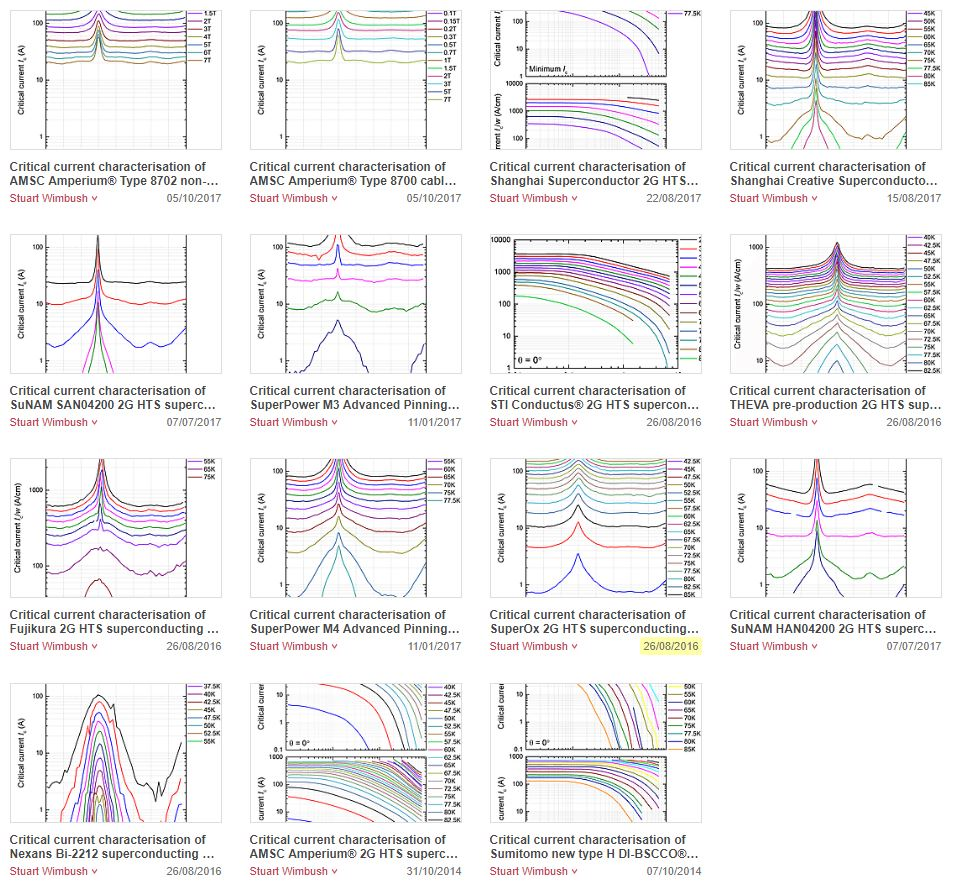
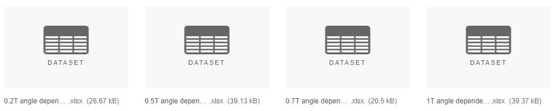
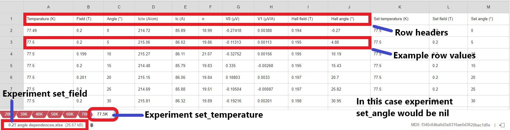

# Back End Documentation
**Author:** David Hack (dhack8@gmail.com)

**Date:** 18/10/2018

# Initial Setup

The back end uses [Ruby on Rails](https://rubyonrails.org/) and [PostgreSQL](https://www.postgresql.org/).

1. Install [Ruby](https://www.ruby-lang.org/en/documentation/installation/), this should be some version of 2.XX. We recommend using linux or [Windows Subsystem](https://docs.microsoft.com/en-us/windows/wsl/install-win10) for linux.
2. Install [RVM](https://rvm.io/).
3. Execute `gem install rails`, this should be some version of 5.1.5 to 5.19.
4. Install [PostgreSQL Windows](https://www.postgresql.org/) or [PostgreSQL Linux (Ubuntu)](https://www.digitalocean.com/community/tutorials/how-to-install-and-use-postgresql-on-ubuntu-16-04), with linux installers vary, [Brew](https://brew.sh/) is a popular installer for macOS.
5. Execute `initdb -D ~/pgsql/data` (make sure PostgreSQL is in your path).

The above steps work well on unix based machines. Windows users will likely run into a wide array of unpredictable errors, to many to cover all of them. Even with the linux subsystem on Windows there are many permission errors that can be encountered. If you do chose to use Windows be prepared to do a lot of Googling.

Regardless of your system if you can:

* Get Ruby and Ruby on Rails running with the correct versions.
* And get a PostgreSQL database made.

You should be able to run the back end.

# Running the back end

To run the back end you will need to start the PostgreSQL process then the rails server.

1. Execute `pg_ctl -D ~/pgsql/data start` or `sudo service postgresql start` to run the PostgreSQL background process (make sure PostgreSQL is in your path).
2. Navigate/Make sure you are in the `athena/` directory, this is the name we gave to the back end.
3. Execute `rails s` to start the rails server.
4. If you open `http://localhost:3000/` you should see the rails welcome screen.


**Note:** You do not need to have the front end running to run the back end locally.

# Development notes

The back end uses several libraries to function. Because this documents purpose is not to teach web development from scratch here is some helpful documentation to get you started on any unfamiliar libraries.

* Ruby is the language that the back end is written in. Here is a [Crash course](https://scotch.io/tutorials/a-crash-course-in-ruby).
* Ruby on Rails is the back end framework. [Guides](https://guides.rubyonrails.org/).
* Rails [Jobs](https://edgeguides.rubyonrails.org/active_job_basics.html) for running caching.
* All the data that the back end saves is publicly available through the [Figshare API](https://docs.figshare.com/).
* We interface with the Figshare API with a local gem called [Swagger](https://swagger.io/tools/swagger-codegen/), all the documentation for it can be found in `athena/swagger`.
* We use a gem called [Down](https://github.com/janko-m/down) to download files in the back end.
* We use a gem called [Roo](https://github.com/roo-rb/roo) to read `.xlsx` files from the RRI Figshare database.
* We use a gem called [ActiveModelSerializers](https://github.com/rails-api/active_model_serializers) to convert rails models into JSON objects.

# Caching

The back end has two functions, the first is caching. When we refer to caching we are talking about a process where the back end takes all the data from the [Robinson Research Institute's Figshare Database](https://figshare.com/collections/A_high_temperature_superconducting_HTS_wire_critical_current_database/2861821) and saves it on the PostgreSQL database to be able to serve it to users quickly. Without back end caching requests from the front end to the Figshare API could take upwards of 30 seconds to complete and process.

The whole caching process is encapsulated in these files:

* `athena/app/jobs/update_cache_job.rb`
* `athena/config/application.rb`
* Models found in `athena/app/models`. `dataset.rb`, `experiment.rb`, `row.rb`

### Step 1: Starting the job

The `UpdateCacheJob` found in `athena/app/jobs/update_cache_job.rb` is started when the `rails s` command is executed by:

```ruby
config.after_initialize do
    UpdateCacheJob.perform_later
end
```

in the `application.rb` file.

### Step 2: Performing the job

1. The job requests all the articles from the [RRI Figshare Database](https://figshare.com/collections/A_high_temperature_superconducting_HTS_wire_critical_current_database/2861821). Articles are what Figshare calls each separate HTS dataset. These are the current Figshare articles in the [RRI Figshare Database](https://figshare.com/collections/A_high_temperature_superconducting_HTS_wire_critical_current_database/2861821):



2. Any articles that are not saved in the system already, or have been updated, are cached.

3. A cached `dataset` has `experiments`, and `experiments` have `rows`. These are Rails models and can be found in their respective model files. Each experiment is a sheet in an Excel file. An `experiment` has a `set_temperature`, `set_field` and `set_angle`, an `experiment` has two of this values set (determined by the Excel file name and the sheet name), while the third varies and is saved as `nil`. A `row` is simply the row data from the Excel files without a `set_temperature`, `set_field` and `set_angle` because not all datasets have these columns in the Excel files.

**Small sample of Excel files in a dataset:**





**Note:** The column names can change order and be missing "Set temperature (K)", "Set field (T)" and "Set angle (*)". Also the value in the file name and tab isn't always field and temperature, they could be other combinations of temperature, field and angle.

4. If there is an error during the caching process of a specific dataset the transaction is rolled back and the dataset skipped. This means the dataset will be attempted to be cached on the next cache job.

### Step 3: Queue cache job to run again

The job then sets itself to run again in the `update_period` amount of time (currently 30 minutes).

```ruby
ensure
    UpdateCacheJob.set(wait: update_period).perform_later
end
```

This is done in a `ensure` black similar to `finally` from other languages so it should always be triggered.

### Caching weaknesses/quirks

* The job recursively queues itself, even with the `ensure` block this is a fragile approach. Using a gem like [Sidekiq](https://github.com/mperham/sidekiq/) would be better but requires more setup.
* The job is set to run every 30 minutes as determined by the `update_period` field in job file.
* There are at least 3 different ways one could pull the data from the [RRI Figshare Database](https://figshare.com/collections/A_high_temperature_superconducting_HTS_wire_critical_current_database/2861821). The "All data.xlsx" file has all the data put together but not all datasets have it in the same format and you loss experiment data. The "IV curves.zip" file has all the data including IV curves which are not in the Excel files but its large in size and has only raw data. We chose to use the separate Excel files.
* The job relies heavily on the current structure of how RRI uploads their datasets not allows for any changes to it. There really is no simple solution to this problem.
* If a dataset has an error during caching it is skipped until the next cache job.
* Every time the website is redeployed the cache job has to start from scratch because the database has been cleared.

# Serving data to the front end

The second main function of the back end is to respond to the front ends requests. This allows the front end to quickly display data requested by users.

All the files required for responding to requests are:

* `athena/config/routes.rb`
* `athena/app/controllers/application_controller.rb`
* `athena/app/controllers/datasets_controller.rb`
* `athena/app/commands/datasets/find_valid_filters.rb`
* `athena/app/commands/datasets/filter_dataset_experiments.rb`
* Models found in `athena/app/models`. `dataset.rb`, `experiment.rb`, `row.rb`

## Routes

The routes that the back end responds to are defined on the `athena/config/routes.rb` file. This code snippet defines all the routes:

```ruby
resources :datasets, param: :figshare_id, only: [:index, :show] do
    get 'metadata', action: :metadata, controller: 'datasets'
end
```
The 3 defined routes from this code in `routes.rb` are:

| Prefix | Verb | URI |
| --- | --- | --- |
| dataset_metadata | GET  | /datasets/:dataset_figshare_id/metadata |
| datasets | GET  | /datasets |
| dataset | GET  | /datasets/:figshare_id |

**Note:** by running `rails routes` in `athena/` you can get a more complete print out of the routes.

The `athena/app/controllers/datasets_controller.rb` file handles all the route methods.

**Note:** There is no difference between `:dataset_figshare_id` and `:figshare_id`, they are the same.

## Route: /datasets

This is the route used by the index page of the front end that displays a list of all the datasets.

* **Parameters:** This route has no parameters.
* **Test:** You can test this route by navigating to `http://localhost:3000/datasets.json` in a browser. The response is in JSON format.
* **Method:** The `index` method inside `datasets_controller.rb` is the handler for this route.
* **Process:**  This route simply provides a list of all the latest `datasets` currently saved in the back end by serialising them into JSON objects with [ActiveModelSerializers](https://github.com/rails-api/active_model_serializers).
* **Response Format: (JSON)**

    ```json
    //Example of response with only one dataset in the array
    {
        datasets: [
            {
                cached: true
                defined_type: 4
                doi: "10.6084/m9.figshare.1112565.v8"
                figshare_id: 1112565
                published_date: "2014-10-07T03:31:47.000Z"
                thumbnail: "https://s3-eu-west-1.amazonaws.
                com/pfigshare-u-previews/1706974/thumb.png"
                title: "Critical current characterisation of Sumitomo 
                new type H DI-BSCCO® superconducting wire"
                url_api: "https://api.figshare.com/v2/articles/1112565"
                url_public: "https://figshare.com/articles/
                Critical_current_characterisation_of_Sumitomo_new_type_
                H_DI_BSCCO_superconducting_wire/1112565"
            },
        ]
    }
    ```

## Route: /datasets/:dataset_figshare_id/metadata

This is the route used by the page that displays the dataset to populate all the required metadata field like the title and the constant data. By providing this information in separate query at the start of the page load allows for all subsequent data responses tp be free of this metadata and smaller in size.

* **Parameters:** This route has no parameters, aside from the dataset figshare id in the path.
* **Test:** Navigate to `http://localhost:3000/datasets/5425930/metadata.json` in a browser (assuming you have dataset 5425930) to test the route. The response is in JSON format.
* **Method:** The `metadata` method inside `datasets_controller.rb` is the handler for this method.
* **Process:**
    1. First the method finds the most recent version of the dataset in the database by using the `latest` scope in the `athena/app/models/dataset.rb` model. We don't actually delete old versions of datasets when a new version is cached.
    2. Second the command `FindValidFilters` from `find_valid_filters.rb` is used to find all the valid filters. These are keyed on dependency as they change depending on it. Dependence is implicitly defined in the back end by the "set" column in experiments that is `nil`. for example if a `experiment` had `set_temperature = 50`, `set_field = 7` and `set_angle = nil` then the dependence for that experiment would be angle, ie a angle dependence. The concept of a valid filter is a filter that when applied will actually provide at least some data.
    3. The back end responds by wrapping both the dataset metadata and the valid filters together in a JSON object.
* **Response Format: (JSON)**

    ```json
    //Example of response for figshare id: 5425930
    {
        dataset_meta: {
            figshare_id: 5425930,
            title: "Critical current characterisation of AMSC Amperium® 
            Type 8700 cable formulation 2G HTS superconducting wire",
            doi: "10.6084/m9.figshare.5425930.v1",
            url_api: "https://api.figshare.com/v2/articles/5425930",
            url_public: "https://figshare.com/articles/Critical_
            current_characterisation_of_AMSC_Amperium_Type_8700_cable_
            formulation_2G_HTS_superconducting_wire/5425930",
            thumbnail: "https://s3-eu-west-1.amazonaws.com/pfigshare-u
            -previews/9361414/thumb.png",
            defined_type: 4,
            published_date: "2017-10-05T02:53:00.000Z",
            cached: true
        },
        filters: {
            temperature_dependence: {
                valid_temperatures: [null],
                valid_angles:[0.0],
                valid_fields:[0.0]
            },
            angle_dependence: {
                valid_temperatures: [77.5,75.0,70.0,65.0,60.0,
                55.0,50.0,45.0,40.0,35.0,30.0,25.0,20.0,15.0],
                valid_angles: [null],
                valid_fields: [7.0,5.0,3.0,2.0,1.5,1.0,0.7,0.5,
                0.3,0.2,0.15,0.1,0.07,0.05,0.03,0.02,0.015,0.01]
            },
            field_dependence: {
                valid_temperatures: [77.5,75.0,70.0,65.0,60.0,
                55.0,50.0,45.0,40.0,35.0,30.0,25.0,20.0,15.0],
                valid_angles: [90.0,0.0],
                valid_fields: [null]
            }
        }
    }
    ```

    You may notice that there are no valid filters for the type of dependence that there is. This is correct as this filter is used for the constant value and the constant cannot be the same as the dependence. For example if the dependence is temperature then the constant must either be angle or field.

## Route: /datasets/:figshare_id

This is the route used by the page that displays the dataset to find the specific data the user has requested to view. The backend isn't concerned with exactly what the front end is currently displaying, just the filters. In the most common case its the dependence and the constant value.

* **Parameters:** This route has multiple parameters, aside from the dataset figshare id in the path.
    1. `set_temperature` a number, usually in the range of 0 - 77.5, not enforced. Will return only experiments with a `set_temperature` matching the specified `set_temperature`.
    2. `set_field` a number, usually in the range of 0.01 - 7, not enforced. Will return only experiments with a `set_field` matching the specified `set_field`.
    3. `set_angle` a number, usually in the range of 0 - 90, not enforced. Will return only experiments with a `set_angle` matching the specified `set_angle`.
    4. `dependence`, should be one of `temperature|field|angle` this is used to explicitly inform the back end to only return experiments with this type of dependence. For example a dependence parameter of `temperature` will mean only experiments with a `set_temperature` of `nil` will be returned. This is important else the back end will return any experiment that matches the supplied `set_temperature`, `set_field` and `set_angle`. For example if you asked for all experiments with a set temperature of 77.5K the result would have a mix of both angle and field dependant experiments which is un desirable for the front end.

    Normal usage of these parameters is usually one of the `set_temperature`, `set_field` or `set_angle` and the `dependence` but you are not limited to this combination.

* **Test:** Navigate to `/datasets/5425930.json?set_field=0&dependence=temperature` in a browser (using `localhost:3000` and assuming you have dataset 5425930) to test this route. The response is in JSON format.
* **Method:** The method that handles this request is the `show` method inside `datasets_controller.rb`.
* **Process:**
    1. First the method finds the most recent version of the dataset in the database by using the `latest` scope in the `athena/app/models/dataset.rb` model. We don't actually delete old versions of datasets when a new version is cached.
    2. Second the command `FilterDatasetExperiments` is used to find all the datasets that match the current set of filters. This command also filters out duplicate experiments. Duplicated experiments are from situations where two excel files contain the same set values just in a different order. For example one file could have a temperature of 77.5K in the file name and a tab of 1T (field) while another excel document could have 1T in the file name and a tab with 77.5K.
    3. The back end responds by wrapping all the filtered experiments in a JSON object along with the header names of the values.
* **Response Format: (JSON)**

    ```json
    //Example of response for figshare id: 5425930,
    //?set_field=0&dependence=temperature
    filtered_experiments: [{
        set_temperature: null,
        set_field: 0.0,
        set_angle: 0.0,
        rows: [
            [null,null,null,null,null,null,null,null,null,null],
            [null,null,null,null,null,null,null,null,null,null],
            [null,null,null,null,null,null,null,null,null,null],
            [null,null,null,null,null,null,null,null,null,null],
            [null,null,null,null,null,null,null,null,null,null],
            [null,null,null,null,null,null,null,null,null,null],
            [27.5,0.0,0.0,null,null,null,null,null,0.007,-29.65],
            [30.0,0.0,0.0,2363.87,945.55,17.39,-0.51686,0.00602,
            0.007,-32.11],
            [32.5,0.0,0.0,2256.45,902.58,22.62,-0.40489,0.00583,
            0.007,-31.91],
            [35.0,0.0,0.0,2104.98,841.99,18.44,-0.07678,0.00566,
            0.006,-29.19],
            [37.49,0.0,0.0,1999.81,799.93,23.33,-0.13191,0.00565,
            0.006,-28.76],
            [40.01,0.0,0.0,1878.01,751.2,22.68,0.16435,0.00567,
            0.007,-29.61],
            [42.5,0.0,0.0,1763.77,705.51,24.12,-0.16819,0.00562,
            0.006,-26.82],
            [45.0,0.0,0.0,1631.3,652.52,20.07,-0.05501,0.00547,
            0.006,-24.71],
            [47.5,0.0,0.0,1534.81,613.93,23.75,-0.03677,0.00568,
            0.006,-29.09],
            [50.0,-0.001,0.0,1425.05,570.02,23.08,0.12221,0.00572,
            0.006,-28.64],
            [52.5,0.0,0.0,1320.93,528.37,24.94,-0.137,0.00513,
            0.006,-27.71],
            [55.0,0.0,0.0,1236.44,494.57,31.17,-0.20299,0.00616,
            0.006,-25.54],
            [57.5,0.0,0.0,1131.33,452.53,28.56,-0.44356,0.00594,
            0.006,-29.48],
            [60.0,0.0,0.0,1044.48,417.79,31.54,-0.10069,0.00584,
            0.006,-29.03],
            [62.5,0.0,0.0,950.52,380.21,32.28,-0.2516,0.0057,
            0.005,-30.29],
            [65.0,0.0,0.0,857.86,343.14,29.5,-0.19205,0.00591,
            0.006,-27.34],
            [67.5,0.0,0.0,772.88,309.15,35.71,-0.06323,0.00609,
            0.005,-25.85],
            [70.0,0.0,0.0,671.24,268.5,28.97,0.12873,0.00505,
            0.006,-29.36],
            [72.5,0.0,0.0,579.67,231.87,31.21,0.03666,0.00439,
            0.006,-25.68],
            [75.0,0.0,0.0,481.13,192.45,27.76,0.26357,0.00398,
            0.006,-24.32],
            [77.5,0.0,0.0,385.92,154.37,28.62,-0.00997,0.00795,
            0.005,-25.68],
            [80.0,0.0,0.0,286.57,114.63,28.02,-0.03211,0.00441,
            0.006,-29.17],
            [82.5,0.0,0.0,188.28,75.31,23.31,0.03547,0.00535,
            0.006,-27.23],
            [85.0,0.0,0.0,97.66,39.06,16.94,-0.28803,0.00992,
            0.005,-25.49],
            [87.5,0.0,0.0,27.36,10.94,8.84,-0.01997,0.0102,
            0.005,-25.43],
            [89.99,0.0,0.0,0.78,0.31,2.82,0.0186,0.01,
            0.005,-24.53],
            [92.5,0.001,0.0,null,null,null,null,null,0.006,-25.44],
            [95.0,0.0,0.0,null,null,null,null,null,0.006,-28.51]
        ],
        row_header: ["temperature","field","angle","icw","ic",
        "n","v0","v1","hall_field","hall_angle"]
    }]
    ```

    As you can see the response only contains one experiment in the array of experiments. This experiment matches the query parameters with a `set_field` of 0 and a dependence of temperature, shown by `set_temperature` being `null`. The `row_header` value is to save sending the same key value pairs for every row in the experiment.

# Other Back End Considerations

* In order to interact with external components like the front end [CORS](https://developer.mozilla.org/en-US/docs/Web/HTTP/CORS) needs to be enabled. We did this through this line `protect_from_forgery unless: -> { request.format.json? }` in the `application_controller.rb` file. As well as the gem [rack-cors](https://github.com/cyu/rack-cors) with the code:

    ```ruby
    config.middleware.insert_before 0, Rack::Cors do
        allow do
            origins '*'
            resource '*', :headers => 
            :any, :methods => [:get, :post, :options]
        end
    end
    ```
    in the `athena/config/application.rb` file.

* The ID of the RRI Figshare database/collection is `2861821` and is referenced in the `athena/app/jobs/update_cache_job.rb` file as a field: `@target_collection = 2861821`. This solution is clearly not the cleanest way to reference the root of the data, but it does work.