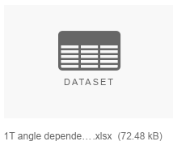

# Domain Knowledge Documentation

**Author:** David Hack (dhack8@gmail.com)

**Date:** 19/10/2018

# Robinson Research Institute

The Robinson Research Institute [(RRI)](https://www.victoria.ac.nz/robinson) are world leaders in high-temperature superconducting wire critical current data. They have a [Figshare repository](https://figshare.com/collections/A_high_temperature_superconducting_HTS_wire_critical_current_database/2861821) that they upload their HTS experiment results to.

# Experiments

There are three experimental variables:

* Temperature (K)
* Field (T)
* Angle (°)

In each test two of these will be constant while the third varies, making it the dependent variable. For example if a test had a set temperature of `77.5K` and a field of `1T` then the dependence of the test would ba angle dependence.

The way that RRI likes to present these tests is to display multiple test lines on the same graph. As can be seen above this is a set of tests with an angle dependence which is plotted across the x axis. The field is set to `1T` for all the tests. There is then a different line for each different set temperature `15K` through to `77.5K`. On the y axis is critical current. The y axis can vary between critical current, critical current per width and n-value.

**Note:** The back end refers to these tests as `experiments`.

# Datasets

The RRI Figshare repository contains 15 datasets currently. Each dataset contains graph images, separate Excel files and a .zip with all the source data. An example of a dataset stored in the RRI Figshare repository is [AMSC Amperium® Type 8700 cable formulation 2G](https://figshare.com/articles/Critical_current_characterisation_of_AMSC_Amperium_Type_8700_cable_formulation_2G_HTS_superconducting_wire/5425930) the format of the datasets is not 100% the same. Some datasets have different columns in the Excel files and the order can vary.

## Dataset pictures

These are pictures generated from the Excel files and are what the client wants to be recreated in a dynamic website. These have no value for any sort of solution and will largely be ignored by the implementation.

## Specific Test Excel Files

These files contain several tabs and specify the `set` experiment variables through the file name and the tab title. The dependence is also specified in the file name. These files can be used to retrieve all the data and are the files we used in the implementation. There is some redundancy between these files such as some angle dependency files having both temperature and field on the file name and field and temperature on the tab titles.

## All Data Excel File

This file contains all the experiments appended together in a long single sheet. Unfortunately this means that the information of each separate test and it dependence is lost. Furthermore, not all the datasets have an all data file with the `set` columns. These are required since they cannot be found from the file name and tab title.

## IV Curves Zip File

This file contains the raw data of all the tests with little formating. Every data point in the Excel files is actually from another curve, called the IV curve. This file didn't contain all the different dependency tests however. It is also a large file at around `30mb`.
