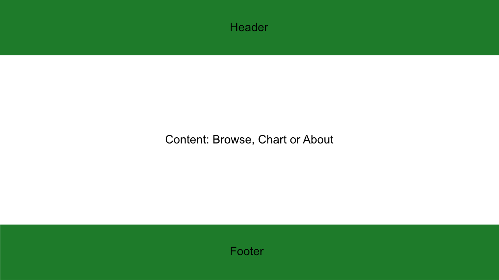
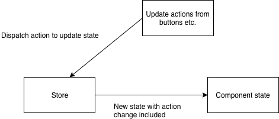
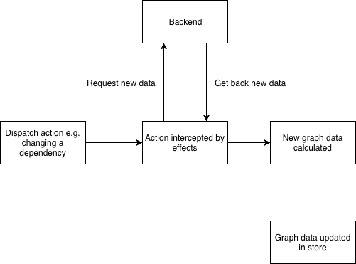

# Front End Documentation

**Author:** Brady Hanna (hannabradyw@gmail.com) and Ben Percy (percyben8@gmail.com)

**Date:** 18/10/2018

# Installation

The front end uses [Angular](https://angular.io) and some additional libraries.

1. Install [Node and npm](https://nodejs.org/en/download/).
2. Have your terminal open in the `visualizer/` directory of the project.
3. Execute `npm install` which will install all the required npm modules for the project.


# Running

1. Open your terminal of choice to the `visualizer/` directory of the project.
2. Execute `npm start` to run.
3. Open `http://localhost:4200` to view the front end in your browser. 

**Note:** the back end also needs to be running in order to run the project locally.

# Development notes

This document will primarily focus on the business logic within the front end. The reason behind this is that the majority of components used are from well-known libraries and they already have extensive documentation (that we used in developing this application).

Useful documentation:

* [Angular](https://angular.io/docs) is our core framework responsible for most of the heavy lifting.
* [Chart.js](http://www.chartjs.org/docs/latest/) is used to display graphs to the user
* [Angular Material](https://material.angular.io/components/categories) is used for material-styled components
* [@ngrx/store](https://github.com/ngrx/platform/blob/master/docs/store/README.md) is used for state management
* [@ngrx/effects](https://github.com/ngrx/platform/blob/master/docs/effects/README.md) is used to handle side effects, which mainly consists with handling network request to the back end when wanting to change the state

# Branding

Branding is isolated to the [templates](angular temapltes) (`.html` files) of the `header` and `footer` components, as well as the index.html file. In particular the following files:

* `visualizer/src/app/footer/header.component.html` 
* `visualizer/src/app/footer/footer.component.html`
* `visualizer/src/index.html` 

## Header

To update the url of the image edit the `src` property of the `` tag. In particular, replace the `https://static.victoria.ac.nz/images/logo-white-full.svg` with the new url.

```html

```

## Footer

To update the url of the image edit the `src` property of the following `` tag similar to the header. 

```html

```

The text `Victoria University of Wellington, New Zealand` within the HTML can be replaced as needed too.

```html
<p class="copyright-text footer-text">
  Website Design &copy; {{year}} Victoria University of 
    Wellington, New Zealand |
      ...
</p>
```

## Favicon

To update the tab icon or favicon of the page, there are two options.
The first is to update the icon address. This is found in the `index.html` file. Currently it points to a local file in the same directory as index.html, `favicon.ico`, but this can be changed to any address. 

```html
<link rel="icon" type="image/x-icon" href="favicon.ico">
```
The second way is to change the favicon.ico file. This can be done by replacing the current file with an icon of the same name. Currently the link to the Victoria University icon is found under `https://ecs.victoria.ac.nz/favicon.ico` so if it changes it should be updated here.


# Architecture

The main focus on the architecture was to have a central source of data, with seperate components responsible for presenting the data. The central source of data uses `@ngrx/store` to provide a single application state. 

## Data structures

Data structures are based on the format that the back end sends the information in. We have created interfaces for all of the data that comes form the back end, plus some additional ones that are front end specific (such as dependency types). These interfaces can be found in `visualizer/src/app/_shared/interfaces`.

The four most important values in relation to what is currently being displayed on the chart are:

1. Dependency (Temperature, Angle, Field)
2. Constant (Temperature, Angle, Field but cannot be the same as the dependency)
3. Constant value (number value, depends on dataset)
4. Selected yAxis (ic, icw, n-value)

These values are what is retrieved from the back end and constitute the core of the values needed to replicate data from figshare.

In addition to these values, extra values are also used for graph configuration purposes:

* Log scale (for X and Y axis)
* High contrast mode
* Alternating points mode
* Point size
* Line tension (straight or curved)

All of the above listed values are stored in the state, where the properties can be seen below (see `visualizer/src/app/_ngrx/vis.state.ts` for more detail) :

```typescript
export interface VisState {
  graphLoaded: boolean;
  figshareId: number;
  doi: string;
  experiments: IExperiment[];
  datasetTitle: string;
  graphTitle: string;
  yAxis: IYAxis;
  logScaleY: boolean;
  logScaleX: boolean;
  highContrastMode: boolean;
  alternatePointsMode: boolean;
  lineTension: boolean;
  pointSize: number;
  dependency: IXAxis;
  constant: IXAxis;
  constantValue: number;
  constantValues: IFilterOptions;
}
```

You will notice that dependency, constant and yAxis are typed as `IYAxis` and `IXAxis`. You can see the definitions in the following file `visualizer/src/app/_shared/interfaces/axis.ts`.

The idea of these interfaces is so that the currently selected variable contains all the relevant information needed for formatting and backend querying uses. This means that instead of having to use a look-up table, attributes on the actual passed around object can be used. 

An example of parent interface for both `IYAxis` and `IXAxis` is the following:

```typescript
interface IAxis {
  variable: string;
  axisName: string;
  unit: string;
  bracketedUnit: string;
  csvName: string;
}
```

In this file all of the possible combinations are defined as constant objects. Therefore, when updating a formatting value it only needs to be changed once (in this file), and that change will propagate throughout the rest of the application.

## Presentation

There are 6 main components involved with presentation:

* Header
* Footer
* Browse
* Chart
* Base-chart (wrapper for chart.js)
* About

### Structure of the web page

 

At all times there is a header and footer at the top and bottom of the page respectively. The section in the middle has content that depends on the current route of the application (uses the Angular `router-outlet`).

| Route | Component |
| --- | --- | 
| `/` | Browse |
| `/dataset` | Chart |
| `/about` | About |


### Chart

The chart component contains the logic for the buttons controlling the chart. It also contains the displayed chart (base-chart), but does not handle the logic. Chart component does not directly store the data related to the currently selected variables, but instead gets this from the store (discussed in the next section). In order to update the chart, Chart component dispatched actions to the store.

For example, we want to set the dependency to a new value. The following method will be called with the new dependency which will then be processed by the store. This then causes the graph to be updated where the data will reflect the value of the dependency given in the action.


```typescript
public setDependency(event) {
    this._store.dispatch(new ChangeDependencyAction(event.value));
  }
```



### Base-chart

Base-chart is a wrapper around `chart.js` which is the internal library we are using to plot data. Base chart does not directly store the data, but instead gets this from the store (discussed in the next section).
Base-Chart does however contain the chart element of the graph. It subsequently also contains all of the logic for the chart. These are the more important/complicated areas of logic handled in Base-Chart. 

#### Important Methods


1. `ngAfterViewInit()`
The first of these is ngAfterViewInit. This method is only called once the Base-Chart's component has fully loaded. This method subscribes to the @ngrx/store, and sets all of the fields of Base-Chart to the values inside in the store. It then initialises the chart. After initialisation, it customises the data inside all aspects of the chart, such as the data, axes, and point tooltips to reflect the user’s selections. 

1. `mapExperimentsToChartData(state)`
This method is called during the initialization of the charts data, inside the ngAfterViewInit variable setting. It works out what data should be displayed inside the chart. It takes the dependence and constant variables and works out which values inside the experiment are valid. Each experiment is a row of data, but only certain points of this line are going to be used when forming the data points. It then gets the valid points as two arrays, xVals and yVals. 
These are the lists of data points to be displayed. ChartJS however can only draw data in x and y axis pairs. This data is mapped to x and y points and stored inside the variable chartJSPoints. The colour and point shape of the line is then calculated. Finally, the line is created. This is then done for every single line (experiment) inside the chart. 

3. `formatTopOfTooltip(item, data)` and `formatBottomOfTooltip(tooltipItems)`
These methods decides what information to display on the hover tooltip of each point on the chart. 
formatTopofTooltip displays the temperature, angle, and field of each point. Due to the nature of how the information is retrieved, each variable of the method needs to be returned in a different order depending on which constant and dependency are selected. There are three variables, each of which corresponding to either temperature, angle or field. 
These variables are taken from the x axis labels of the graph, and from the title. This is why they differ depending on the dependence and constants. As the information in the title and labels are too long, this needs to be shortened. This is done through a series of regexs. This shortens each variable down to only the number and unit of measurement.
It should be noted that each regex matches specific characters from the title and labels. If at any point these change, the regexs match will fail. The last part of the method returns the variables in the correct order. To maintain consistency over each graph they are returned in a different order, so that when viewed in the graph, the information is consistent. 


1. `switchAxisScale(log, axis)`
This method changes the axis scale of the chart, between linear and logarithmic. It does this by configuring the scales option inside the chart. This can be set to either logarithmic or linear. 
When the axis is in linear mode, every single grid line that is on the chart has a value on the linear axis. In logarithmic however this is different. Only numbers in the power of 10 are shown (eg 1, 10, 100, 1000), as well as the final value of the axis. This logic is contained inside the callback in this method. It changes only returns axis points if it is a power of 10, or is the final value of the axis. 


## Figshare service

This service is used to get data from the backend. All requests to the back end should be done through this service so that the front end is not dependant on back end API implementation.

There are three main requests:

1. `getListOfDatasets()` List of datasets which is used to populate the browse page
2. `getMetadata(id: number)` is used to get the metadata of a particular dataset. This is used initial page load, and when. This metadata contains information such as the dataset title, but most importantly the possible constant values for each valid constant. The `id` param is the *figshare id* which will be retrieved from the `getListOfDatasets()`.
3. `getExperiments(id, dependence, constant, constantValue)` is used to get the chart data for each `dependence`, `constant`, `constantValue` combination. This will return a list of experiments which will then be mapped into lines to be plotted with **chart.js**.


**Note:** consult the back end documentation for more detail on what each of the routes supplies, or look at the interface for the `Observable` returned by each function.

## @ngrx/store

The store contains all of the data for the currently displayed graph and options such as point size and contrast options. 

By using the store it means that any component is able to request a state change, any component can also see the state and get updates when it changes. 

The main interaction with the store revolves around the UI buttons dispatching actions upon being clicked, which will then go through the reducers and update the state. The graph is then subscribed to changes in the store state, and when it does update will update the graph and the new graph will be displayed.

**Note:** consult the *Data structures* section for more detail on what values are used for configuring the graph.

## @ngrx/effects

 

The above diagram details the basic process of events that occurs when a new action is dispatched. The benefit of using `@ngrx/store` and `@ngrx/effects` is that the store state is `Observable` so that as the state changes over time the components that are subscribed (in particular the `base-chart`) will get the new values and then be able to update.

Effects are used when an action requested on the graph needs to request new data from the back end. These actions that effects handles are:

* Initial load
* Dependency change
* Constant change
* Constant value change

Changing the dependency will result in a constant and constant value change. Changing the constant will result in a constant value change. This means that any change to the three values will result in a request to the back end.

**The basic process for each effect is as follows:**

1. Triggered by the dispatch of an action
2. Calculate the new dependency, constant and constant value
3. Query the back end with the new values calculated
4. Receive the new data from the backend and calculate the new graph title
5. Dispatch an action to the store to set the new experiments
