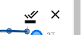

# User Manual

## Home Page

* Datasets can be filtered by typing in the filter box. This filters by the name of the dataset. Any dataset with a name that matches what was typed in will be displayed, and all others won't be. 

  
* Datasets can be sorted by their name alphabetically, or by their publication date. The current method of sorting can be changed by clicking on the desired header, and the direction can be changed by another click on that header. The current sorting method is displayed by the arrow on the headers. 
  

* Each dataset has its own row. Clicking anywhere on that row, apart from the Figshare column, will take you to the datasets page for that dataset.

* The image on the far right of each row links to the Figshare entry for that specific dataset.
  
## Datasets Page

### Graph

* Each individual point on the graph is represented by a dot. Hovering over these with the mouse will show a tooltip, detailing the data at that point. 
  

* Each line can be hidden by clicking on its corresponding entry on the right of the graph.
  

* All lines can be hidden by clicking the hide all button on the right of the graph.
  

* All lines can be shown by clicking the show all button on the right of the graph.
  
### Independent Variables

* The dependence can be changed by clicking on a non-highlighted variable. 

  
* The constant variable can be changed by clicking on a non-highlighted variable. The constant variable cannot be changed to the same one as the dependence. The constant value can be set from the drop-down below the constant selector. 
  

* The scale of the independent variable can be changed by selecting either Linear or Logarithmic.
  

### Dependent Variables 

* The dependent variable can be changed by selecting Ic, Ic/w, or n-value.
  

* The scale of the dependent variable can be changed by selecting either Linear or Logarithmic.
  

### Appearance

* Lines style can be changed between a smooth blue to black gradient and a high contrast color mode.
  

* Line style can be changed between straight lines and curved lines.
  

* The point style can be changed between circles and alternating point styles.
 

* The size of the points can be changed with the point size slider.
  

### Export

* The graph can be downloaded as a png by clicking the image button.
  

* The graph can be downloaded as a .csv file by clicking the file button.
  

* The graph can be printed by clicking the print button.
  

* The creative commons image links to the license information on the creative commons website.
  

* The DOI can be copied to the clipboard by clicking Copy DOI button and can be pasted anywhere needed.
  

### Other

* The Figshare image next to the title links to the original Figshare page for that dataset.
  
## Header

* The Victoria logo on the top left links back to the datasets list page.
  

* "High-temperature superconducting wire critical current database" links back to the datasets list page.
  

## Footer

* "Robinson Research Institute" links to the RRI homepage.
  

* The Victoria logo links to the VUW homepage.

* "About" links to the About page for this website.

* "Contact" opens up the default email client to send an email to RRI.
